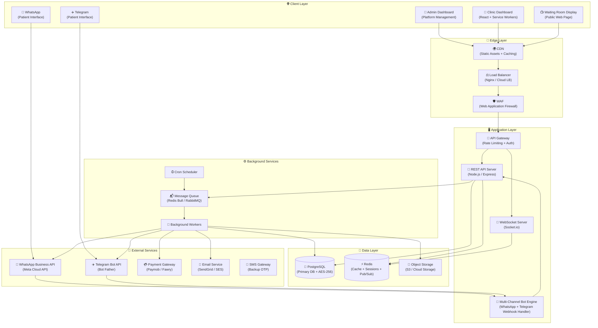
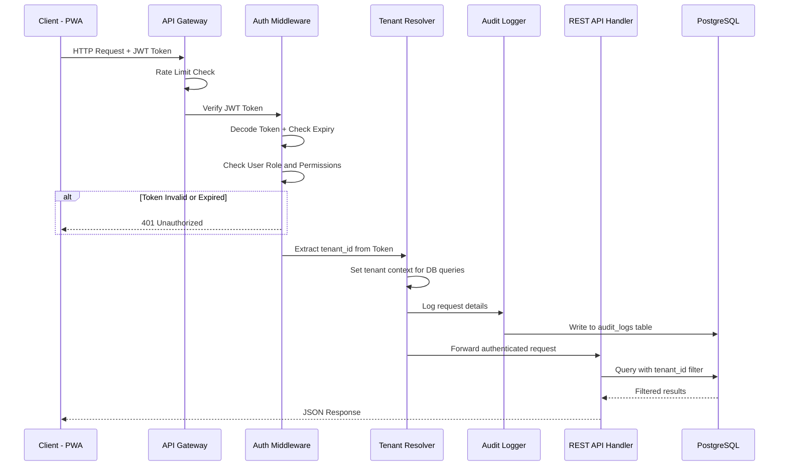
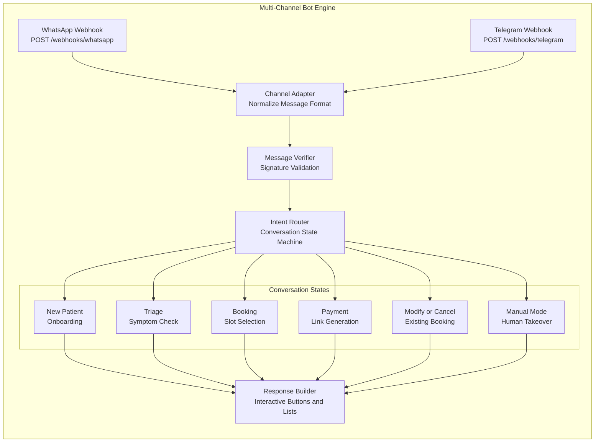
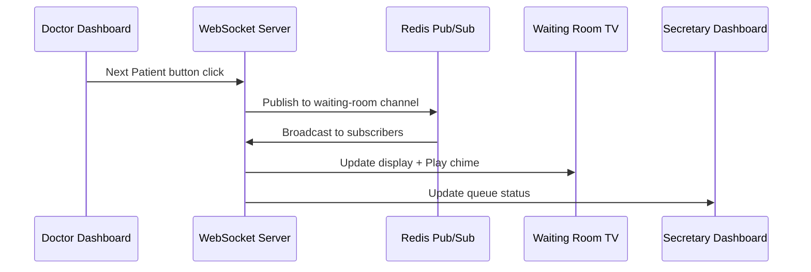
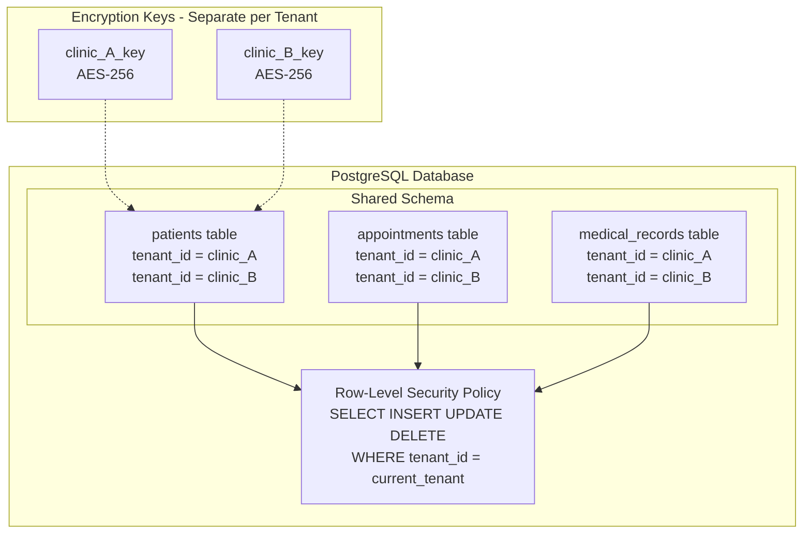
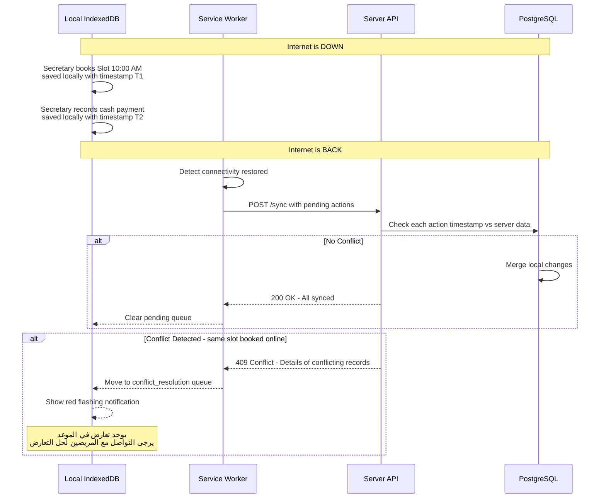
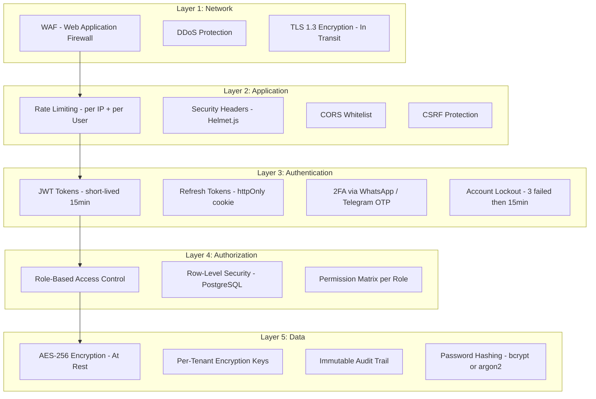
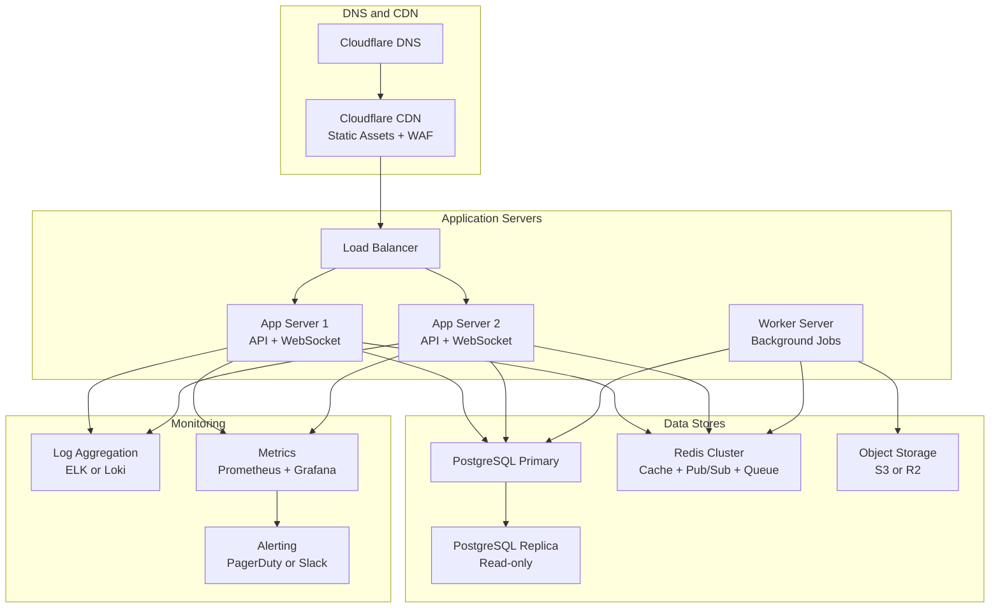

# 📐 مستند البنية التحتية الكاملة — منصة عيادتي الذكية (Smart Clinic OS)
**الإصدار:** 1.0  
**التاريخ:** 2026-07-01  
**المستند:** 1 من 9

---

## 1. نظرة عامة على النظام (System Overview)

منصة عيادتي الذكية هي **تطبيق ويب سحابي متعدد المستأجرين (Multi-Tenant SaaS)** مصمم لإدارة العيادات الطبية بشكل كامل، مع تكامل عميق مع **WhatsApp Business API** و**Telegram Bot API** لأتمتة رحلة المريض من الحجز للدفع عبر قنوات متعددة.

### المبادئ المعمارية الأساسية (Architectural Principles)

| المبدأ | الشرح |
|--------|-------|
| **Offline-First** | النظام يعمل بدون إنترنت عبر PWA + IndexedDB ويزامن عند العودة |
| **Multi-Tenant Isolation** | فصل بيانات كل عيادة بشكل صارم عبر `tenant_id` + مفاتيح تشفير منفصلة |
| **Event-Driven** | العمليات الخلفية (إلغاء حجز، إرسال رسائل) تتم عبر Message Queue |
| **API-First** | كل الوظائف متاحة عبر REST API موثقة بالكامل |
| **Security by Design** | التشفير، الـ Audit Trail، والـ RBAC مدمجين في كل طبقة |

---

### 1.4 هيكل الروابط والنطاقات (Frontend Domains & Routing Structure)

ينقسم الوصول لواجهات النظام (Frontend Clients) إلى مستويين معزولين تماماً لضمان الأمان والوضوح التشغيلي:

| الواجهة (Client) | هيكل الرابط (URL / Domain) | الشرح والوظيفة |
|------------------|---------------------------|----------------|
| **لوحة تحكم مشغل المنصة / الأوبريشن (Platform Owner Dashboard)** | `https://www.SCS-ops.com` | رابط مستقل معزول مخصص للشركة المصنعة والمشغل لإضافة العيادات وتفعيل الاشتراكات وإدارة الـ feature flags والتقارير المالية الإجمالية. (نشر خاص مغلق ومحمي بـ VPN). |
| **بوابة العيادة الافتراضية للعملاء (Clinics Dashboard)** | `https://www.SCS-admin.com/:clinic-slug` | الرابط الافتراضي للعيادات (مثل: `https://www.SCS-admin.com/dr-ahmed-dental`). يسجل الطبيب والسكرتارية الدخول من هنا لإدارة الكاليندر والروشتات. |
| **النطاق المخصص للعيادة (Custom Domain)** | `https://clinic-subdomain.SCS-admin.com` أو نطاق خارجي `https://clinic.drahmed.com` | متاح لباقات الاشتراك المتقدمة (Enterprise) لربط نطاق مخصص بالعيادة. |
| **شاشة تلفزيون الانتظار (TV Queue Screen)** | `https://www.SCS-admin.com/:clinic-slug/tv` | صفحة ويب عامة تفتحها السكرتارية على شاشة التلفزيون بالعيادة لعرض الطابور، وتتصل عبر WebSockets لاستقبال التحديثات الفورية. |

---

## 2. مخطط البنية العامة (High-Level Architecture)



---

## 3. اختيار التقنيات (Technology Stack)

### 3.1 Frontend Stack

| التقنية | الغرض | السبب |
|---------|-------|-------|
| **React 18+** | بناء الواجهات | Component-based، ecosystem ضخم، وأداء ممتاز مع Virtual DOM |
| **TypeScript** | Type Safety | يقلل الأخطاء ويسهل الصيانة في مشروع بهذا الحجم |
| **Vite** | Build Tool | أسرع من Webpack بمراحل في التطوير والبناء |
| **React Router v6** | التنقل | Nested routes + protected routes للصلاحيات |
| **Zustand** | State Management | خفيف وبسيط مقارنة بـ Redux، مثالي لـ offline state |
| **React Query (TanStack)** | Server State | Caching ذكي + offline support + background refetching |
| **Socket.io Client** | Real-time | لشاشة الانتظار والـ live chat |
| **Workbox** | Service Workers | إدارة الـ PWA والـ offline caching بسهولة |
| **Dexie.js** | IndexedDB Wrapper | واجهة سهلة لقاعدة البيانات المحلية |
| **Chart.js / Recharts** | التقارير والرسوم البيانية | رسوم بيانية تفاعلية للتقارير المالية |
| **React-PDF** | توليد الروشتات | إنشاء ملفات PDF للروشتات الإلكترونية |

### 3.2 Backend Stack

| التقنية | الغرض | السبب |
|---------|-------|-------|
| **Node.js 20 LTS** | Runtime | Non-blocking I/O مثالي لـ real-time + WhatsApp/Telegram webhooks |
| **Express.js** | HTTP Framework | خفيف ومرن ومدعوم بـ middleware ecosystem كبير |
| **TypeScript** | Type Safety | نفس اللغة في الـ Frontend والـ Backend |
| **Socket.io** | WebSockets | Real-time لشاشة الانتظار وتحديثات الشات |
| **Bull / BullMQ** | Job Queue | إدارة الـ background jobs (إلغاء حجز، إرسال رسائل جماعية) |
| **node-cron** | Cron Jobs | الـ scheduled tasks (timeout الحجوزات، الحملات المجدولة) |
| **Passport.js + JWT** | Authentication | نظام auth مرن يدعم JWT + 2FA |
| **Helmet.js** | Security Headers | حماية الـ HTTP headers |
| **express-rate-limit** | Rate Limiting | حماية من الـ brute-force والـ DDoS |
| **Winston** | Logging | Structured logging للـ audit trail |
| **Joi / Zod** | Validation | التحقق من صحة البيانات الداخلة |

### 3.3 Database & Storage

| التقنية | الغرض | السبب |
|---------|-------|-------|
| **PostgreSQL 16** | Primary Database | ACID compliance، JSON support، Row-Level Security للـ multi-tenant |
| **pgcrypto** | Encryption at Rest | AES-256 encryption مدمج في PostgreSQL |
| **Redis 7** | Cache + Sessions + Pub/Sub | سريع جداً للـ sessions، caching، وقناة الـ WebSocket Pub/Sub |
| **AWS S3 / Cloudflare R2** | Object Storage | تخزين صور المرضى، ملفات PDF الروشتات، والـ media |

### 3.4 Infrastructure & DevOps

| التقنية | الغرض | السبب |
|---------|-------|-------|
| **Docker** | Containerization | بيئة تطوير وإنتاج موحدة |
| **Docker Compose** | Local Development | تشغيل كل الخدمات محلياً بسهولة |
| **Nginx** | Reverse Proxy + Load Balancer | SSL termination + static file serving |
| **GitHub Actions** | CI/CD | أتمتة الاختبارات والنشر |
| **AWS / DigitalOcean / Hetzner** | Cloud Hosting | اختيار مرن حسب الميزانية |
| **Let's Encrypt** | SSL/TLS | شهادات HTTPS مجانية |

---

## 4. تفصيل المكونات (Component Deep Dive)

### 4.1 الـ API Gateway

الـ API Gateway هو نقطة الدخول الوحيدة لكل الـ requests اللي بتوصل للنظام.

**المسؤوليات:**
- ✅ **Authentication**: التحقق من الـ JWT Token في كل request
- ✅ **Rate Limiting**: تحديد عدد الـ requests لكل مستخدم/IP
- ✅ **Tenant Resolution**: تحديد الـ `tenant_id` من الـ JWT وحقنه في كل query
- ✅ **Request Logging**: تسجيل كل request في الـ Audit Trail
- ✅ **CORS**: التحكم في الـ origins المسموح لها بالاتصال



### 4.2 الـ Multi-Channel Bot Engine (WhatsApp + Telegram)

المكون المسؤول عن استقبال ومعالجة رسائل المرضى من **واتساب وتليجرام**. يستخدم **Channel Adapter Pattern** بحيث الـ State Machine واحدة والـ Transport Layer مختلف لكل قناة.

**البنية الداخلية:**



**مبدأ الـ Conversation State Machine:**

كل محادثة مريض ليها **حالة (State)** محفوظة في Redis مع TTL (مدة انتهاء). الـ Bot Engine بيقرأ الحالة الحالية ويحدد الخطوة التالية:

| الحالة (State) | الوصف | الخطوة التالية |
|---------------|-------|---------------|
| `IDLE` | لا توجد محادثة نشطة | استقبال رسالة جديدة → فحص هل مسجل ولا لا |
| `ONBOARDING_NAME` | مريض جديد — في انتظار الاسم | بعد الاسم → `ONBOARDING_AGE` |
| `ONBOARDING_AGE` | في انتظار السن | بعد السن → `ONBOARDING_GENDER` |
| `ONBOARDING_GENDER` | في انتظار الجنس | بعد الجنس → `TRIAGE` |
| `TRIAGE` | في انتظار الشكوى | فحص كلمات الطوارئ → `BOOKING_DAY` أو تحذير |
| `BOOKING_DAY` | عرض الأيام المتاحة | بعد اختيار اليوم → `BOOKING_SLOT` |
| `BOOKING_SLOT` | عرض الساعات المتاحة | بعد اختيار الساعة → `PAYMENT_PENDING` |
| `PAYMENT_PENDING` | في انتظار الدفع | Webhook الدفع → `CONFIRMED` أو Timeout → `CANCELLED` |
| `MANUAL_MODE` | السكرتير ماسك المحادثة | انتهاء المدة أو إعادة تفعيل البوت → `IDLE` |

### 4.3 الـ Real-time Layer (WebSockets)

**القنوات (Channels):**

| القناة | الغرض | المشتركين |
|--------|-------|-----------|
| `waiting-room:{tenant_id}` | تحديثات شاشة الانتظار | شاشة TV + Dashboard |
| `chat:{tenant_id}` | رسائل الشات الجديدة | السكرتير في الـ Inbox |
| `notifications:{tenant_id}:{user_id}` | إشعارات شخصية | المستخدم المعني |
| `booking-updates:{tenant_id}` | تحديثات الحجوزات (تأكيد/إلغاء) | الكاليندر في الـ Dashboard |

**آلية العمل:**



### 4.4 الـ Background Workers

**أنواع الـ Jobs:**

| Job Name | Trigger | الوظيفة | Priority |
|----------|---------|---------|----------|
| `payment-timeout` | بعد المدة المحددة من الطبيب من إنشاء رابط الدفع | إلغاء الحجز + تحرير الـ Slot + إرسال رسالة عبر القناة الأصلية (واتساب/تليجرام) | High |
| `send-message` | عند الحاجة لإرسال رسالة | إرسال رسالة عبر WhatsApp API أو Telegram Bot API حسب القناة | High |
| `send-email-notification` | تأكيد حجز، إلغاء، أو اعتماد روشتة (حسب الإعدادات) | إرسال بريد إلكتروني للمريض أو الطبيب/السكرتير مع المرفقات إن وجدت | Medium |
| `send-ops-subscription-alert` | أي حركة اشتراك (عيادة جديدة، ترقية، إلغاء، تنبيه انتهاء) | إرسال إشعار فوري لفريق العمليات للشركة المصنعة على `ops@SCS-ops.com` | Medium |
| `bulk-campaign` | حملة مجدولة | إرسال رسائل جماعية بفاصل عشوائي 2-5 ثوانٍ | Medium |
| `generate-prescription-pdf` | الطبيب يعتمد الروشتة | توليد PDF + QR Code + إرسال للمريض | Medium |
| `sync-offline-data` | عودة الاتصال بعد انقطاع | مزامنة البيانات المحلية مع السيرفر + فض النزاعات | High |
| `audit-log-write` | أي عملية في النظام | كتابة سجل غير قابل للتعديل | Low |
| `cleanup-expired-sessions` | كل ساعة (Cron) | حذف الـ sessions المنتهية | Low |
| `compute-tenant-usage` | يومياً (Cron) | حساب إحصائيات الاستخدام لكل عيادة وتحديث `tenant_usage_stats` | Low |
| `check-subscription-expiry` | يومياً (Cron) | فحص اشتراكات العيادات المنتهية + إرسال إشعارات (7 أيام، 3 أيام، يوم) + تعطيل تلقائي | Medium |
| `admin-password-reset` | طلب من الأدمن | إنشاء رابط إعادة تعيين وإرساله للطبيب | High |

---

## 5. بنية الـ Multi-Tenant (عزل البيانات)

### 5.1 استراتيجية العزل

نستخدم **Shared Database, Shared Schema** مع **Row-Level Security (RLS)** في PostgreSQL:



### 5.2 كيف يتم العزل في كل Request

1. الـ JWT Token بيحتوي على `tenant_id`
2. الـ Tenant Resolver Middleware بيستخرج الـ `tenant_id` ويحطه في الـ database session
3. PostgreSQL RLS Policy بتضمن إن كل query بيشوف بيانات الـ tenant بتاعه بس
4. مفتاح التشفير الخاص بكل tenant محفوظ في **Key Management Service** منفصل

```sql
-- مثال على RLS Policy
CREATE POLICY tenant_isolation ON patients
    USING (tenant_id = current_setting('app.current_tenant')::uuid);

---

### 5.3 التحكم بالمميزات والخصائص ديناميكياً (Subscription Tiers & Feature Flags)

لإدارة باقات الاشتراك المرنة (Basic, Pro, Enterprise)، يتبع النظام آلية **Dynamic Feature Flags** على مستويين:

1. **مستوى التفعيل والترخيص (Platform Admin):**
   عند إنشاء أو تحديث حساب العيادة (`tenants` table)، يقوم أدمن المنصة بتحديد الحقول الثلاثة الأساسية بناءً على الباقة المدفوعة:
   - `allow_multi_doctor` (أطباء متعددين)
   - `allow_insurance` (التأمين الطبي)
   - `allow_refunds` (الاسترداد التلقائي)

2. **مستوى التحكم والتشغيل (Doctor/Clinic Owner):**
   إذا كانت الميزة مرخصة ومفعلة من أدمن المنصة، تظهر خيارات إعداداتها في لوحة تحكم الطبيب (مثل تحديد شركات التأمين، أو تحديد شروط المتابعات، أو تفعيل حسابات الأطباء الفرعيين). إذا كانت مغلقة، تُحجب تماماً من واجهة الإعدادات.

3. **آلية التحقق البرمجية (Middleware Level):**
   يحتوي السيرفر على Middleware مخصص (`checkFeatureFlag.ts`) للتحقق من الميزة قبل تنفيذ أي طلب API أو بدء فلو البوت:

```typescript
// Middleware example to check dynamic features
export const checkFeature = (feature: 'allow_multi_doctor' | 'allow_insurance' | 'allow_refunds') => {
  return async (req: Request, res: Response, next: NextFunction) => {
    const tenant = req.tenant; // Loaded via TenantResolver
    if (!tenant[feature]) {
      return res.status(403).json({
        error: 'FEATURE_LOCKED',
        message: 'هذه الميزة غير متوفرة في باقة اشتراكك الحالية. يرجى الترقية لتفعيلها.'
      });
    }
    next();
  };
};
```
على مستوى الـ Bot، يتم استخدام نفس الآلية قبل عرض قوائم الأطباء أو طلب التأمين الطبي.


-- في كل request الـ middleware بيعمل:
SET app.current_tenant = 'clinic_A_uuid';
```

> [!CAUTION]
> كل query **لازم** يمر عبر الـ RLS — أي query مباشر على الـ database بدون الـ tenant context ممنوع منعاً باتاً.

---

## 6. بنية الـ Offline-First (العمل بدون إنترنت)

### 6.1 ما يتم تخزينه محلياً

| البيانات | طريقة التخزين | متى يتم التحديث |
|----------|-------------|-----------------|
| الواجهات والـ Assets | Service Worker Cache | عند كل deploy جديد |
| مواعيد اليوم | IndexedDB | كل 5 دقائق + عند أي تغيير |
| بيانات مرضى اليوم | IndexedDB | عند فتح ملف المريض |
| إعدادات العيادة | IndexedDB | عند تسجيل الدخول |
| الـ Pending Actions (عمليات لم ترفع) | IndexedDB Queue | عند عودة الاتصال |

### 6.2 آلية المزامنة وفض النزاعات



### 6.3 قواعد فض النزاعات

| نوع التعارض | القاعدة |
|-------------|---------|
| **حجز نفس الـ Slot** | الحجز اللي تم أونلاين (عبر البوت مع دفع) له الأولوية — الحجز المحلي ينتقل لقائمة النزاعات |
| **تعديل بيانات مريض من جهتين** | Last-Write-Wins مع الاحتفاظ بنسخة من كلا التعديلين في الـ Audit Log |
| **تسجيل دفع كاش أوفلاين** | يتم قبوله دائماً لأنه لا يتعارض مع بيانات أونلاين |

---

## 7. بنية الأمان (Security Architecture)

### 7.1 طبقات الحماية



### 7.2 الـ JWT Token Structure

```json
{
  "header": {
    "alg": "RS256",
    "typ": "JWT"
  },
  "payload": {
    "sub": "user_uuid",
    "tenant_id": "clinic_uuid",
    "role": "doctor | secretary",
    "permissions": ["calendar:read", "calendar:write", "patients:read"],
    "iat": 1234567890,
    "exp": 1234568790
  }
}
```

**سياسة الـ Tokens:**

| النوع | المدة | التخزين |
|-------|-------|---------|
| Access Token | 15 دقيقة | Memory (JavaScript variable) |
| Refresh Token | 7 أيام | httpOnly Secure Cookie |
| OTP Code | 5 دقائق | Redis with TTL |
| Password Reset Link | 15 دقيقة | Database with expiry flag |

### 7.3 الـ Audit Trail Structure

كل عملية في النظام بيتم تسجيلها في جدول `audit_logs` غير قابل للتعديل:

```
audit_logs:
  - id: UUID
  - tenant_id: UUID
  - user_id: UUID
  - action: "patient.view" | "appointment.create" | "payment.record" | ...
  - resource_type: "patient" | "appointment" | ...
  - resource_id: UUID
  - details: JSONB (encrypted)
  - ip_address: INET
  - user_agent: TEXT
  - created_at: TIMESTAMPTZ
```

> [!IMPORTANT]
> الـ `audit_logs` table ليس عليها أي `UPDATE` أو `DELETE` permissions — فقط `INSERT` و `SELECT`. حتى الـ database admin مايقدرش يحذف أو يعدل سجلات.

---

## 8. بنية النشر والتشغيل (Deployment Architecture)

### 8.1 بيئة الإنتاج (Production)



### 8.1.1 عزل بيئة تشغيل المنصة (Private Deployment of Platform Operations Dashboard)

لوحة تحكم مشغل المنصة / الأوبريشن (`https://www.SCS-ops.com`) والـ APIs التابعة لها (`https://api.SCS-ops.com/admin/v1`) يتم نشرها بشكل **خاص ومغلق تماماً (Private Deployment)** على خوادم داخلية وشبكة معزولة لضمان عدم تعرض لوحة الإدارة لأي وصول غير مصرح به:

1. **الشبكة الافتراضية الخاصة (VPC / Private Subnet):** خوادم الـ API وقاعدة البيانات الخاصة بالأدمن تُوضع في Subnet خاص لا يملك عناوين IP عامة (Public IPs) ولا يتصل مباشرة بالإنترنت.
2. **الاتصال عبر الـ VPN:** للوصول للرابط `https://www.SCS-ops.com` أو واجهاتها، يجب على مهندسي وموظفي الأوبريشن الاتصال بشبكة افتراضية خاصة (Private VPN) معتمدة للشركة المصنعة.
3. **حماية الهوية والأجهزة (Zero Trust Access Gateways):** يتم دمج بوابة حماية (مثل Cloudflare Access) تتطلب مصادقة ثنائية (Multi-Factor Authentication) والتحقق من سلامة جهاز الموظف قبل توجيه الطلب إلى السيرفر الخاص بالأوبريشن.
4. **تقييد عناوين الـ IP (IP Whitelisting):** الـ Load Balancer يعيد توجيه الطلبات الخاصة بـ `www.SCS-ops.com` فقط إذا كانت قادمة من عناوين الـ IP المعتمدة الخاصة بـ VPN الشركة، ويمنع أي وصول خارجي آخر برمز خطأ `403 Forbidden`.

### 8.2 بيئة التطوير (Development)

```yaml
# docker-compose.yml (ملخص)
services:
  app:         # Node.js API + WebSocket
  worker:      # Background Job Processor
  postgres:    # PostgreSQL 16
  redis:       # Redis 7
  minio:       # S3-compatible Object Storage (local)
  nginx:       # Reverse Proxy
```

---

## 9. الأداء والتوسع (Scalability Considerations)

### 9.1 استراتيجية التوسع

| المكون | الاستراتيجية | متى نوسع |
|--------|-------------|----------|
| **API Servers** | Horizontal Scaling (إضافة سيرفرات) | عند > 1000 request/sec |
| **PostgreSQL** | Read Replicas + Connection Pooling (PgBouncer) | عند > 500 concurrent connections |
| **Redis** | Redis Cluster | عند > 10GB cached data |
| **WebSocket** | Sticky Sessions + Redis Pub/Sub للتوزيع | عند > 5000 concurrent connections |
| **Workers** | إضافة worker instances | عند تراكم الـ queue > 1000 job |

### 9.2 الـ Caching Strategy

| البيانات | Cache Location | TTL | Invalidation |
|----------|---------------|-----|--------------|
| إعدادات العيادة | Redis | 1 ساعة | عند التعديل |
| قائمة الأدوية (Autocomplete) | Redis + Browser | 24 ساعة | يومياً |
| الـ Slots المتاحة | Redis | 30 ثانية | عند كل حجز |
| بيانات الـ Session | Redis | حسب الـ token expiry | عند الـ logout |
| الـ Static Assets | CDN + Service Worker | حسب الـ build version | عند كل deploy |

---

## 10. التكاملات الخارجية (External Integrations Overview)

> [!NOTE]
> سيتم تفصيل كل تكامل في مستند منفصل (المستند رقم 6). هذا ملخص سريع فقط.

| الخدمة | الغرض | طريقة التكامل |
|--------|-------|---------------|
| **WhatsApp Business API (Meta Cloud API)** | بوت المحادثة + الإشعارات + الحملات | Webhooks (incoming) + REST API (outgoing) |
| **Telegram Bot API (BotFather)** | بوت المحادثة + الإشعارات + الحملات (بديل/إضافي) | Webhooks (incoming) + REST API (outgoing) |
| **Paymob** | الدفع بالكروت البنكية | Payment Intent API + Webhooks |
| **Fawry** | الدفع عبر فوري | Reference Code API + Webhooks |
| **Vodafone Cash / Etisalat Cash** | المحافظ الإلكترونية | عبر Paymob كـ aggregator |
| **SendGrid / AWS SES** | البريد الإلكتروني (استعادة كلمة المرور) | REST API |
| **ICD-11 API (WHO)** | أكواد التشخيصات الطبية | REST API (read-only) |
| **Google Maps API** | إرسال موقع العيادة للمريض | Static Map Link |

---

## 11. ملخص القرارات المعمارية (Architecture Decision Records)

| القرار | الخيار المختار | البدائل المرفوضة | السبب |
|--------|---------------|-----------------|-------|
| Database Strategy | Shared DB + RLS | DB-per-tenant | أسهل في الإدارة والتكلفة في المرحلة الأولى، مع إمكانية التحويل لاحقاً |
| Backend Framework | Express.js | NestJS, Fastify | أبسط، ecosystem أكبر، أسهل للفريق |
| Frontend Framework | React + Vite | Next.js, Vue | أخف — مش محتاجين SSR لأن ده SaaS dashboard |
| State Management | Zustand | Redux, Recoil | أبسط API، أقل boilerplate، ممتاز للـ offline state |
| Message Queue | BullMQ with Redis | RabbitMQ, SQS | نفس الـ Redis اللي بنستخدمه — أقل infrastructure |
| Real-time | Socket.io | SSE, WebSocket raw | أسهل في الاستخدام + fallback تلقائي + rooms support |

---

## 12. أسئلة مفتوحة محتاجة قرار

> [!IMPORTANT]
> الأسئلة دي محتاجة إجابة قبل ما نكمل المستندات التالية:

1. **الـ Hosting Provider**: هل في تفضيل معين (AWS, DigitalOcean, Hetzner, أو غيرهم)؟ ده بيأثر على تفاصيل الـ deployment.
2. **الـ WhatsApp API Provider**: هل هنستخدم **Meta Cloud API** مباشرة ولا عبر وسيط زي **360dialog / Twilio**؟
3. **الـ Telegram Bot**: الـ Bot هيتعمل عبر **BotFather** مباشرة، والـ Webhook هيتربط بالسيرفر.
3. **الـ Primary Payment Gateway**: هل **Paymob** هو الاختيار الأساسي ولا في بوابة دفع تانية مفضلة؟
4. **حجم الفريق المتوقع**: كام مطور هيشتغلوا على المشروع؟ ده بيأثر على قرارات الـ code architecture والـ monorepo vs microservices.

