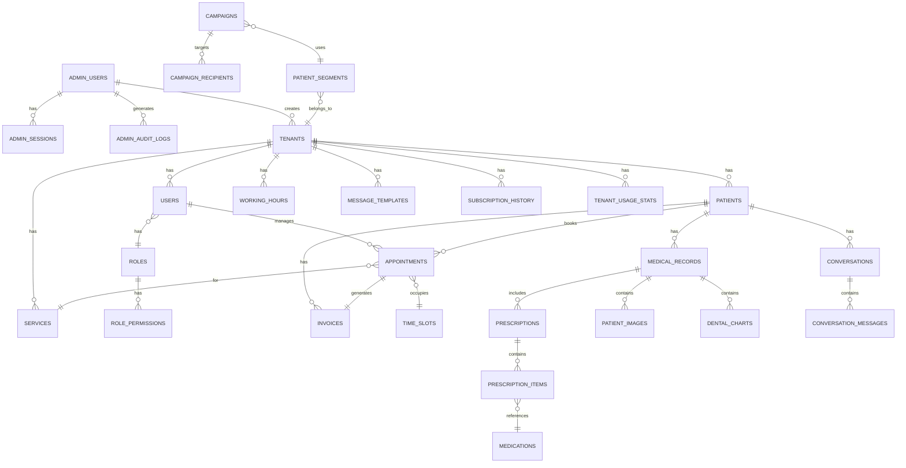

# 🗄️ مستند نموذج البيانات الكامل — منصة عيادتي الذكية (Smart Clinic OS)
**الإصدار:** 1.0  
**التاريخ:** 2026-07-01  
**المستند:** 2 من 9

---

## 1. نظرة عامة (Overview)

هذا المستند يوثق **كل جداول قاعدة البيانات** اللي النظام محتاجها، مع العلاقات بينهم، أنواع البيانات، الـ Indexes، والـ Constraints. الهدف إن أي مطور يقدر يبني الـ database schema بالكامل من هذا المستند فقط.

### المبادئ الأساسية للـ Data Model

| المبدأ | التطبيق |
|--------|---------|
| **Multi-Tenant Isolation** | كل جدول فيه `tenant_id` + Row-Level Security |
| **Soft Delete** | لا نحذف بيانات نهائياً — نستخدم `deleted_at` timestamp |
| **Audit Ready** | كل جدول فيه `created_at`, `updated_at`, `created_by`, `updated_by` |
| **UUID Primary Keys** | نستخدم UUID v4 بدل Auto-increment لأمان أكثر + multi-tenant support |
| **Encryption at Rest** | الحقول الحساسة (اسم المريض، التشخيص، إلخ) مشفرة بـ AES-256 عبر `pgcrypto` |
| **Timestamps in UTC** | كل الأوقات تُحفظ بـ UTC ويتم التحويل في الـ Frontend حسب timezone العيادة |

---

## 2. مخطط العلاقات الكامل (Entity Relationship Diagram)



---

## 3. تفصيل الجداول (Table Definitions)

---

### 📦 المجموعة 0: إدارة المنصة (Platform Administration)

> [!IMPORTANT]
> جداول الأدمن **منفصلة تماماً** عن جداول العيادات. الأدمن لا ينتمي لأي tenant — هو يدير المنصة ككل.

---

#### 3.0.1 `admin_users` — مدراء المنصة

| العمود | النوع | القيود | الوصف |
|--------|-------|--------|-------|
| `id` | `UUID` | `PK` | المعرف الفريد |
| `email` | `VARCHAR(255)` | `NOT NULL, UNIQUE` | البريد الإلكتروني |
| `password_hash` | `VARCHAR(255)` | `NOT NULL` | كلمة المرور المشفرة (argon2) |
| `full_name` | `VARCHAR(255)` | `NOT NULL` | الاسم بالكامل |
| `phone` | `VARCHAR(20)` | `NOT NULL` | رقم الهاتف (للـ 2FA) |
| `role` | `VARCHAR(30)` | `NOT NULL, DEFAULT 'admin'` | الدور (super_admin, admin, support) |
| `is_active` | `BOOLEAN` | `DEFAULT true` | هل الحساب نشط |
| `two_factor_enabled` | `BOOLEAN` | `DEFAULT true` | 2FA مفعل (إجباري لحسابات الأدمن) |
| `two_factor_secret` | `VARCHAR(255)` | `NULL` | مفتاح الـ 2FA (مشفر) |
| `failed_login_attempts` | `INTEGER` | `DEFAULT 0` | عدد محاولات الدخول الفاشلة |
| `locked_until` | `TIMESTAMPTZ` | `NULL` | مقفول حتى |
| `last_login_at` | `TIMESTAMPTZ` | `NULL` | آخر تسجيل دخول |
| `last_login_ip` | `INET` | `NULL` | آخر IP |
| `created_at` | `TIMESTAMPTZ` | `DEFAULT NOW()` | |
| `updated_at` | `TIMESTAMPTZ` | `DEFAULT NOW()` | |

**أنواع أدوار الأدمن:**

| الدور | الصلاحيات |
|-------|----------|
| `super_admin` | كل شيء — إنشاء/حذف أدمن آخرين + كل صلاحيات admin |
| `admin` | إنشاء/تعديل/تعطيل حسابات الأطباء والعيادات + إدارة الاشتراكات + عرض الإحصائيات |
| `support` | عرض بيانات العيادات (قراءة فقط) + إعادة تعيين كلمات مرور الأطباء |

```sql
CREATE UNIQUE INDEX idx_admin_users_email ON admin_users(email);
```

---

#### 3.0.2 `admin_sessions` — جلسات مدراء المنصة

| العمود | النوع | القيود | الوصف |
|--------|-------|--------|-------|
| `id` | `UUID` | `PK` | المعرف الفريد |
| `admin_id` | `UUID` | `FK → admin_users.id, NOT NULL` | الأدمن |
| `refresh_token_hash` | `VARCHAR(255)` | `NOT NULL, UNIQUE` | الـ refresh token مشفر |
| `ip_address` | `INET` | `NOT NULL` | |
| `user_agent` | `TEXT` | `NULL` | |
| `is_active` | `BOOLEAN` | `DEFAULT true` | |
| `expires_at` | `TIMESTAMPTZ` | `NOT NULL` | |
| `created_at` | `TIMESTAMPTZ` | `DEFAULT NOW()` | |
| `last_used_at` | `TIMESTAMPTZ` | `DEFAULT NOW()` | |

---

#### 3.0.3 `admin_audit_logs` — سجل عمليات الأدمن

> [!CAUTION]
> مثل `audit_logs` — لا يقبل UPDATE أو DELETE.

| العمود | النوع | القيود | الوصف |
|--------|-------|--------|-------|
| `id` | `UUID` | `PK` | المعرف الفريد |
| `admin_id` | `UUID` | `FK → admin_users.id, NOT NULL` | الأدمن |
| `action` | `VARCHAR(100)` | `NOT NULL` | نوع العملية |
| `target_type` | `VARCHAR(50)` | `NOT NULL` | نوع الهدف (tenant, user, subscription) |
| `target_id` | `UUID` | `NULL` | معرف الهدف |
| `details` | `JSONB` | `NULL` | تفاصيل العملية |
| `ip_address` | `INET` | `NOT NULL` | |
| `user_agent` | `TEXT` | `NULL` | |
| `created_at` | `TIMESTAMPTZ` | `DEFAULT NOW()` | |

**أمثلة على قيم `action`:**

| القيمة | الوصف |
|--------|-------|
| `admin.login` | تسجيل دخول أدمن |
| `admin.login_failed` | محاولة دخول فاشلة |
| `tenant.create` | إنشاء عيادة جديدة |
| `tenant.activate` | تفعيل عيادة |
| `tenant.deactivate` | تعطيل عيادة |
| `user.create_doctor` | إنشاء حساب طبيب |
| `user.password_reset` | إعادة تعيين كلمة مرور طبيب |
| `subscription.change` | تغيير خطة اشتراك |
| `subscription.extend` | تمديد اشتراك |
| `subscription.expire` | انتهاء اشتراك (تلقائي) |

```sql
REVOKE UPDATE, DELETE ON admin_audit_logs FROM app_user;
CREATE INDEX idx_admin_audit_date ON admin_audit_logs(created_at DESC);
CREATE INDEX idx_admin_audit_action ON admin_audit_logs(action, created_at DESC);
CREATE INDEX idx_admin_audit_target ON admin_audit_logs(target_type, target_id);
```

---

#### 3.0.4 `subscription_history` — سجل تغييرات الاشتراكات

| العمود | النوع | القيود | الوصف |
|--------|-------|--------|-------|
| `id` | `UUID` | `PK` | المعرف الفريد |
| `tenant_id` | `UUID` | `FK → tenants.id, NOT NULL` | العيادة |
| `action` | `VARCHAR(30)` | `NOT NULL` | نوع التغيير (created, upgraded, downgraded, extended, expired, renewed) |
| `old_plan` | `VARCHAR(50)` | `NULL` | الخطة السابقة |
| `new_plan` | `VARCHAR(50)` | `NOT NULL` | الخطة الجديدة |
| `old_expires_at` | `TIMESTAMPTZ` | `NULL` | تاريخ الانتهاء السابق |
| `new_expires_at` | `TIMESTAMPTZ` | `NOT NULL` | تاريخ الانتهاء الجديد |
| `reason` | `TEXT` | `NULL` | سبب التغيير |
| `changed_by_admin_id` | `UUID` | `FK → admin_users.id, NULL` | الأدمن اللي عمل التغيير (NULL لو تلقائي) |
| `created_at` | `TIMESTAMPTZ` | `DEFAULT NOW()` | |

```sql
CREATE INDEX idx_sub_history_tenant ON subscription_history(tenant_id, created_at DESC);
```

---

#### 3.0.5 `tenant_usage_stats` — إحصائيات استخدام العيادات

> [!NOTE]
> يتم تحديث هذا الجدول **يومياً** عبر Cron Job لتوفير إحصائيات سريعة للوحة الأدمن بدون الحاجة لعمل queries ثقيلة على جداول العيادات.

| العمود | النوع | القيود | الوصف |
|--------|-------|--------|-------|
| `id` | `UUID` | `PK` | المعرف الفريد |
| `tenant_id` | `UUID` | `FK → tenants.id, NOT NULL` | العيادة |
| `date` | `DATE` | `NOT NULL` | التاريخ |
| `total_patients` | `INTEGER` | `DEFAULT 0` | إجمالي المرضى المسجلين |
| `new_patients_today` | `INTEGER` | `DEFAULT 0` | مرضى جدد اليوم |
| `total_appointments` | `INTEGER` | `DEFAULT 0` | إجمالي الحجوزات |
| `appointments_today` | `INTEGER` | `DEFAULT 0` | حجوزات اليوم |
| `completed_appointments` | `INTEGER` | `DEFAULT 0` | حجوزات مكتملة |
| `no_show_count` | `INTEGER` | `DEFAULT 0` | عدم حضور |
| `total_revenue` | `DECIMAL(12,2)` | `DEFAULT 0` | إجمالي الإيرادات |
| `revenue_today` | `DECIMAL(12,2)` | `DEFAULT 0` | إيرادات اليوم |
| `online_payments_count` | `INTEGER` | `DEFAULT 0` | عدد الدفع الأونلاين |
| `cash_payments_count` | `INTEGER` | `DEFAULT 0` | عدد الدفع الكاش |
| `bot_conversations` | `INTEGER` | `DEFAULT 0` | محادثات البوت |
| `bot_successful_bookings` | `INTEGER` | `DEFAULT 0` | حجوزات ناجحة عبر البوت |
| `whatsapp_messages_sent` | `INTEGER` | `DEFAULT 0` | رسائل واتساب مرسلة |
| `storage_used_bytes` | `BIGINT` | `DEFAULT 0` | حجم التخزين المستخدم |
| `active_users_count` | `INTEGER` | `DEFAULT 0` | عدد المستخدمين النشطين اليوم |
| `last_doctor_login` | `TIMESTAMPTZ` | `NULL` | آخر تسجيل دخول للطبيب |
| `created_at` | `TIMESTAMPTZ` | `DEFAULT NOW()` | |

```sql
CREATE UNIQUE INDEX idx_usage_stats_tenant_date ON tenant_usage_stats(tenant_id, date);
CREATE INDEX idx_usage_stats_date ON tenant_usage_stats(date DESC);
```

---

### 📦 المجموعة 1: إدارة المستأجرين والمستخدمين (Tenant & User Management)

---

#### 3.1 `tenants` — العيادات / المستأجرين

الجدول الأساسي اللي بيمثل كل عيادة مسجلة في النظام.

| العمود | النوع | القيود | الوصف |
|--------|-------|--------|-------|
| `id` | `UUID` | `PK, DEFAULT gen_random_uuid()` | المعرف الفريد للعيادة |
| `slug` | `VARCHAR(100)` | `NOT NULL, UNIQUE` | الرمز اللاتيني المخصص لرابط العيادة (مثال: dr-ahmed-dental) |
| `custom_domain` | `VARCHAR(255)` | `NULL, UNIQUE` | النطاق المخصص للعيادة للباقات الكبرى (مثال: clinic.drahmed.com) |
| `name` | `VARCHAR(255)` | `NOT NULL` | اسم العيادة |
| `name_ar` | `VARCHAR(255)` | `NULL` | اسم العيادة بالعربي |
| `specialty` | `VARCHAR(100)` | `NOT NULL` | التخصص (جلدية، أسنان، عيون، إلخ) |
| `logo_url` | `TEXT` | `NULL` | رابط شعار العيادة في Object Storage |
| `phone` | `VARCHAR(20)` | `NOT NULL, UNIQUE` | رقم هاتف العيادة الرسمي |
| `whatsapp_phone_id` | `VARCHAR(50)` | `NULL` | معرف رقم الواتساب في Meta API |
| `whatsapp_business_id` | `VARCHAR(50)` | `NULL` | معرف حساب الـ WhatsApp Business |
| `telegram_bot_token` | `VARCHAR(100)` | `NULL` | توكن بوت التليجرام (مشفر بالـ AES-256) |
| `telegram_bot_username` | `VARCHAR(100)` | `NULL` | يوزرنيم بوت التليجرام (مثل: @MyClinicBot) |
| `email` | `VARCHAR(255)` | `NOT NULL, UNIQUE` | البريد الإلكتروني للعيادة |
| `address` | `TEXT` | `NULL` | العنوان النصي |
| `latitude` | `DECIMAL(10,8)` | `NULL` | خط العرض (للخريطة) |
| `longitude` | `DECIMAL(11,8)` | `NULL` | خط الطول (للخريطة) |
| `google_maps_url` | `TEXT` | `NULL` | رابط موقع العيادة على Google Maps |
| `timezone` | `VARCHAR(50)` | `NOT NULL, DEFAULT 'Africa/Cairo'` | المنطقة الزمنية |
| `currency` | `VARCHAR(3)` | `NOT NULL, DEFAULT 'EGP'` | العملة |
| `default_exam_duration` | `INTEGER` | `NOT NULL, DEFAULT 20` | مدة الكشف الافتراضية بالدقائق |
| `online_discount_percent` | `DECIMAL(5,2)` | `DEFAULT 10.00` | نسبة الخصم للدفع الأونلاين |
| `payment_timeout_minutes` | `INTEGER` | `DEFAULT 15` | مدة انتهاء رابط الدفع |
| `subscription_plan` | `VARCHAR(50)` | `NOT NULL, DEFAULT 'trial'` | خطة الاشتراك (trial, basic, pro, enterprise) |
| `allow_multi_doctor` | `BOOLEAN` | `NOT NULL, DEFAULT false` | هل مسموح للعيادة بإضافة أكثر من دكتور (يفعلها الأدمن) |
| `allow_insurance` | `BOOLEAN` | `NOT NULL, DEFAULT false` | هل مسموح بالتعامل بالتأمين الطبي (يفعلها الأدمن) |
| `allow_refunds` | `BOOLEAN` | `NOT NULL, DEFAULT false` | هل مسموح بإرجاع المبالغ أونلاين تلقائياً (يفعلها الأدمن) |
| `subscription_expires_at` | `TIMESTAMPTZ` | `NULL` | تاريخ انتهاء الاشتراك |
| `is_active` | `BOOLEAN` | `DEFAULT true` | هل العيادة نشطة |
| `deactivation_reason` | `VARCHAR(100)` | `NULL` | سبب التعطيل (subscription_expired, admin_deactivated, violation) |
| `settings` | `JSONB` | `DEFAULT '{}'` | إعدادات إضافية مرنة |
| `encryption_key_ref` | `VARCHAR(255)` | `NOT NULL` | مرجع مفتاح التشفير في KMS |
| `created_by_admin_id` | `UUID` | `FK → admin_users.id, NULL` | الأدمن اللي أنشأ العيادة |
| `created_at` | `TIMESTAMPTZ` | `DEFAULT NOW()` | تاريخ الإنشاء |
| `updated_at` | `TIMESTAMPTZ` | `DEFAULT NOW()` | تاريخ آخر تعديل |

**Indexes:**
```sql
CREATE UNIQUE INDEX idx_tenants_phone ON tenants(phone);
CREATE UNIQUE INDEX idx_tenants_email ON tenants(email);
CREATE UNIQUE INDEX idx_tenants_slug ON tenants(slug);
CREATE UNIQUE INDEX idx_tenants_custom_domain ON tenants(custom_domain) WHERE custom_domain IS NOT NULL;
CREATE INDEX idx_tenants_specialty ON tenants(specialty);
CREATE INDEX idx_tenants_active ON tenants(is_active) WHERE is_active = true;
```

**ملاحظة:** حقل `settings` من نوع JSONB يحتوي على إعدادات مثل:
```json
{
  "night_hours_start": "22:00",
  "night_hours_end": "08:00",
  "bot_welcome_message": "مرحباً بك في عيادة د. أحمد",
  "enable_2fa": true,
  "dental_chart_enabled": false,
  "derma_images_enabled": true,
  "notification_settings": {
    "patient_email_booking_confirm": true,
    "patient_whatsapp_booking_confirm": true,
    "patient_email_prescription": true,
    "patient_email_invoice": true,
    "doctor_email_new_booking": true,
    "doctor_whatsapp_new_booking": false,
    "doctor_email_daily_report": true,
    "doctor_email_weekly_report": true
  }
}
```

---

#### 3.2 `roles` — الأدوار

| العمود | النوع | القيود | الوصف |
|--------|-------|--------|-------|
| `id` | `UUID` | `PK` | المعرف الفريد |
| `tenant_id` | `UUID` | `FK → tenants.id, NOT NULL` | العيادة |
| `name` | `VARCHAR(50)` | `NOT NULL` | اسم الدور (doctor, secretary, marketing_manager) |
| `display_name` | `VARCHAR(100)` | `NOT NULL` | الاسم المعروض (طبيب، سكرتير، مدير تسويق) |
| `is_system_role` | `BOOLEAN` | `DEFAULT false` | هل هو دور نظامي غير قابل للحذف |
| `created_at` | `TIMESTAMPTZ` | `DEFAULT NOW()` | |
| `updated_at` | `TIMESTAMPTZ` | `DEFAULT NOW()` | |

**Indexes:**
```sql
CREATE UNIQUE INDEX idx_roles_tenant_name ON roles(tenant_id, name);
```

---

#### 3.3 `permissions` — الصلاحيات المتاحة

جدول مرجعي (Lookup Table) يحتوي على كل الصلاحيات الممكنة في النظام.

| العمود | النوع | القيود | الوصف |
|--------|-------|--------|-------|
| `id` | `UUID` | `PK` | المعرف الفريد |
| `code` | `VARCHAR(100)` | `UNIQUE, NOT NULL` | كود الصلاحية (مثل `calendar:read`) |
| `module` | `VARCHAR(50)` | `NOT NULL` | الموديول (calendar, patients, finance, settings, chat, marketing) |
| `display_name` | `VARCHAR(200)` | `NOT NULL` | الاسم المعروض |
| `description` | `TEXT` | `NULL` | وصف الصلاحية |

**الصلاحيات المتاحة في النظام:**

| الكود | الموديول | الوصف |
|-------|---------|-------|
| `calendar:read` | calendar | رؤية الكاليندر والمواعيد |
| `calendar:write` | calendar | إنشاء/تعديل/إلغاء المواعيد |
| `calendar:manage_slots` | calendar | إدارة الـ Slots وساعات العمل |
| `patients:read` | patients | رؤية بيانات المرضى الأساسية |
| `patients:write` | patients | تعديل بيانات المرضى |
| `patients:medical_read` | patients | رؤية السجل الطبي (SOAP Notes) |
| `patients:medical_write` | patients | كتابة التشخيص والروشتة |
| `finance:cashier` | finance | تسجيل دفع الكاش |
| `finance:reports` | finance | رؤية التقارير المالية |
| `finance:refund` | finance | عمل استرجاع |
| `chat:read` | chat | رؤية محادثات الواتساب |
| `chat:write` | chat | الرد اليدوي على المحادثات |
| `chat:bot_control` | chat | تفعيل/تعطيل البوت |
| `marketing:segments` | marketing | إنشاء قوائم مستهدفة |
| `marketing:campaigns` | marketing | إرسال حملات جماعية |
| `settings:read` | settings | رؤية الإعدادات |
| `settings:write` | settings | تعديل إعدادات النظام |
| `settings:users` | settings | إدارة المستخدمين والصلاحيات |
| `reports:operational` | reports | التقارير التشغيلية وأداء البوت |
| `waiting_room:manage` | waiting_room | إدارة قائمة الانتظار |

---

#### 3.4 `role_permissions` — ربط الأدوار بالصلاحيات

| العمود | النوع | القيود | الوصف |
|--------|-------|--------|-------|
| `id` | `UUID` | `PK` | المعرف الفريد |
| `role_id` | `UUID` | `FK → roles.id, NOT NULL` | الدور |
| `permission_id` | `UUID` | `FK → permissions.id, NOT NULL` | الصلاحية |
| `granted_by` | `UUID` | `FK → users.id` | مين أعطى الصلاحية |
| `created_at` | `TIMESTAMPTZ` | `DEFAULT NOW()` | |

```sql
CREATE UNIQUE INDEX idx_role_permissions ON role_permissions(role_id, permission_id);
```

---

#### 3.5 `users` — المستخدمين (أطباء وسكرتارية)

| العمود | النوع | القيود | الوصف |
|--------|-------|--------|-------|
| `id` | `UUID` | `PK` | المعرف الفريد |
| `tenant_id` | `UUID` | `FK → tenants.id, NOT NULL` | العيادة |
| `role_id` | `UUID` | `FK → roles.id, NOT NULL` | الدور |
| `email` | `VARCHAR(255)` | `NOT NULL` | البريد الإلكتروني |
| `password_hash` | `VARCHAR(255)` | `NOT NULL` | كلمة المرور المشفرة (bcrypt/argon2) |
| `full_name` | `VARCHAR(255)` | `NOT NULL` | الاسم بالكامل |
| `phone` | `VARCHAR(20)` | `NOT NULL` | رقم الهاتف (للـ 2FA عبر WhatsApp / Telegram) |
| `avatar_url` | `TEXT` | `NULL` | صورة المستخدم |
| `title` | `VARCHAR(100)` | `NULL` | اللقب (دكتور، أخصائي، إلخ) |
| `is_owner` | `BOOLEAN` | `DEFAULT false` | هل هو مالك العيادة (أعلى صلاحية) |
| `is_active` | `BOOLEAN` | `DEFAULT true` | هل الحساب نشط |
| `two_factor_enabled` | `BOOLEAN` | `DEFAULT false` | هل الـ 2FA مفعل |
| `two_factor_secret` | `VARCHAR(255)` | `NULL` | مفتاح الـ 2FA (مشفر) |
| `failed_login_attempts` | `INTEGER` | `DEFAULT 0` | عدد محاولات تسجيل الدخول الفاشلة |
| `locked_until` | `TIMESTAMPTZ` | `NULL` | مقفول حتى (بعد 3 محاولات فاشلة) |
| `last_login_at` | `TIMESTAMPTZ` | `NULL` | آخر تسجيل دخول |
| `last_login_ip` | `INET` | `NULL` | آخر IP سجل دخول منه |
| `created_at` | `TIMESTAMPTZ` | `DEFAULT NOW()` | |
| `updated_at` | `TIMESTAMPTZ` | `DEFAULT NOW()` | |
| `deleted_at` | `TIMESTAMPTZ` | `NULL` | Soft delete |

**Indexes:**
```sql
CREATE UNIQUE INDEX idx_users_tenant_email ON users(tenant_id, email) WHERE deleted_at IS NULL;
CREATE INDEX idx_users_tenant ON users(tenant_id);
CREATE INDEX idx_users_role ON users(role_id);
CREATE INDEX idx_users_active ON users(tenant_id, is_active) WHERE is_active = true;
```

---

#### 3.6 `login_attempts` — سجل محاولات تسجيل الدخول

| العمود | النوع | القيود | الوصف |
|--------|-------|--------|-------|
| `id` | `UUID` | `PK` | المعرف الفريد |
| `email` | `VARCHAR(255)` | `NOT NULL` | البريد المُدخل |
| `ip_address` | `INET` | `NOT NULL` | الـ IP |
| `user_agent` | `TEXT` | `NULL` | المتصفح |
| `success` | `BOOLEAN` | `NOT NULL` | نجحت المحاولة ولا لا |
| `failure_reason` | `VARCHAR(100)` | `NULL` | سبب الفشل (wrong_password, account_locked, not_found) |
| `created_at` | `TIMESTAMPTZ` | `DEFAULT NOW()` | |

```sql
CREATE INDEX idx_login_attempts_email ON login_attempts(email, created_at DESC);
CREATE INDEX idx_login_attempts_ip ON login_attempts(ip_address, created_at DESC);
```

---

#### 3.7 `password_reset_tokens` — توكنات استعادة كلمة المرور

| العمود | النوع | القيود | الوصف |
|--------|-------|--------|-------|
| `id` | `UUID` | `PK` | المعرف الفريد |
| `user_id` | `UUID` | `FK → users.id, NOT NULL` | المستخدم |
| `token_hash` | `VARCHAR(255)` | `NOT NULL, UNIQUE` | الـ token مشفر (SHA-256) |
| `otp_code` | `VARCHAR(6)` | `NULL` | كود OTP للواتساب (مشفر) |
| `method` | `VARCHAR(20)` | `NOT NULL` | طريقة الاستعادة (email_link, whatsapp_otp) |
| `is_used` | `BOOLEAN` | `DEFAULT false` | هل تم استخدامه |
| `expires_at` | `TIMESTAMPTZ` | `NOT NULL` | ينتهي بعد 15 دقيقة |
| `created_at` | `TIMESTAMPTZ` | `DEFAULT NOW()` | |

---

#### 3.8 `user_sessions` — جلسات المستخدمين النشطة

| العمود | النوع | القيود | الوصف |
|--------|-------|--------|-------|
| `id` | `UUID` | `PK` | المعرف الفريد |
| `user_id` | `UUID` | `FK → users.id, NOT NULL` | المستخدم |
| `tenant_id` | `UUID` | `FK → tenants.id, NOT NULL` | العيادة |
| `refresh_token_hash` | `VARCHAR(255)` | `NOT NULL, UNIQUE` | الـ refresh token مشفر |
| `ip_address` | `INET` | `NOT NULL` | |
| `user_agent` | `TEXT` | `NULL` | |
| `device_info` | `JSONB` | `NULL` | معلومات الجهاز |
| `is_active` | `BOOLEAN` | `DEFAULT true` | |
| `expires_at` | `TIMESTAMPTZ` | `NOT NULL` | |
| `created_at` | `TIMESTAMPTZ` | `DEFAULT NOW()` | |
| `last_used_at` | `TIMESTAMPTZ` | `DEFAULT NOW()` | |

---

### 📦 المجموعة 2: إدارة المرضى (Patient Management)

---

#### 3.9 `patients` — المرضى

| العمود | النوع | القيود | الوصف |
|--------|-------|--------|-------|
| `id` | `UUID` | `PK` | المعرف الفريد |
| `tenant_id` | `UUID` | `FK → tenants.id, NOT NULL` | العيادة |
| `phone` | `VARCHAR(20)` | `NOT NULL` | رقم الواتساب (المعرف الأساسي للمريض) |
| `full_name` | `VARCHAR(255)` | `NOT NULL` | الاسم بالكامل (مشفر AES-256) |
| `first_name` | `VARCHAR(100)` | `NOT NULL` | الاسم الأول (للعرض في شاشة الانتظار) |
| `last_name` | `VARCHAR(100)` | `NOT NULL` | اسم العائلة |
| `age` | `INTEGER` | `NULL` | السن |
| `date_of_birth` | `DATE` | `NULL` | تاريخ الميلاد |
| `gender` | `VARCHAR(10)` | `CHECK (gender IN ('male','female'))` | الجنس |
| `email` | `VARCHAR(255)` | `NULL` | البريد الإلكتروني (اختياري) |
| `national_id` | `VARCHAR(20)` | `NULL` | الرقم القومي (مشفر) |
| `blood_type` | `VARCHAR(5)` | `NULL` | فصيلة الدم |
| `allergies` | `TEXT` | `NULL` | الحساسيات المعروفة (مشفر) |
| `chronic_conditions` | `TEXT` | `NULL` | الأمراض المزمنة (مشفر) |
| `emergency_contact_name` | `VARCHAR(255)` | `NULL` | اسم شخص للطوارئ |
| `emergency_contact_phone` | `VARCHAR(20)` | `NULL` | رقم شخص الطوارئ |
| `notes` | `TEXT` | `NULL` | ملاحظات عامة |
| `source` | `VARCHAR(50)` | `DEFAULT 'whatsapp_bot'` | مصدر التسجيل (whatsapp_bot, manual, import) |
| `tags` | `TEXT[]` | `DEFAULT '{}'` | تاجات للتصنيف (VIP, متابعة، إلخ) |
| `total_visits` | `INTEGER` | `DEFAULT 0` | عدد الزيارات الإجمالي (denormalized للأداء) |
| `last_visit_at` | `TIMESTAMPTZ` | `NULL` | تاريخ آخر زيارة (denormalized) |
| `total_paid` | `DECIMAL(12,2)` | `DEFAULT 0` | إجمالي المدفوع (denormalized) |
| `created_at` | `TIMESTAMPTZ` | `DEFAULT NOW()` | |
| `updated_at` | `TIMESTAMPTZ` | `DEFAULT NOW()` | |
| `deleted_at` | `TIMESTAMPTZ` | `NULL` | |

**Indexes:**
```sql
CREATE UNIQUE INDEX idx_patients_tenant_phone ON patients(tenant_id, phone) WHERE deleted_at IS NULL;
CREATE INDEX idx_patients_tenant ON patients(tenant_id);
CREATE INDEX idx_patients_name ON patients(tenant_id, first_name, last_name);
CREATE INDEX idx_patients_last_visit ON patients(tenant_id, last_visit_at DESC);
CREATE INDEX idx_patients_tags ON patients USING GIN(tags);
CREATE INDEX idx_patients_source ON patients(tenant_id, source);
```

> [!NOTE]
> حقل `phone` هو المعرف الأساسي للمريض في النظام — البوت بيتعرف على المريض من رقم الواتساب. لو مريض واحد بيتعامل مع أكثر من عيادة، هيكون ليه record منفصل في كل عيادة (بسبب الـ multi-tenant isolation).

---

### 📦 المجموعة 3: المواعيد والتقويم (Appointments & Calendar)

---

#### 3.10 `services` — الخدمات المقدمة

| العمود | النوع | القيود | الوصف |
|--------|-------|--------|-------|
| `id` | `UUID` | `PK` | المعرف الفريد |
| `tenant_id` | `UUID` | `FK → tenants.id, NOT NULL` | العيادة |
| `name` | `VARCHAR(255)` | `NOT NULL` | اسم الخدمة (كشف عادي، جلسة ليزر، حقن فيلر) |
| `name_ar` | `VARCHAR(255)` | `NULL` | الاسم بالعربي |
| `category` | `VARCHAR(100)` | `NOT NULL` | التصنيف (examination, procedure, surgery) |
| `duration_minutes` | `INTEGER` | `NOT NULL` | مدة الخدمة بالدقائق |
| `price` | `DECIMAL(10,2)` | `NOT NULL` | السعر |
| `online_discount_applicable` | `BOOLEAN` | `DEFAULT true` | هل يطبق عليها خصم الأونلاين |
| `description` | `TEXT` | `NULL` | وصف الخدمة |
| `is_active` | `BOOLEAN` | `DEFAULT true` | |
| `sort_order` | `INTEGER` | `DEFAULT 0` | ترتيب العرض |
| `created_at` | `TIMESTAMPTZ` | `DEFAULT NOW()` | |
| `updated_at` | `TIMESTAMPTZ` | `DEFAULT NOW()` | |

---

#### 3.11 `working_hours` — ساعات العمل

| العمود | النوع | القيود | الوصف |
|--------|-------|--------|-------|
| `id` | `UUID` | `PK` | المعرف الفريد |
| `tenant_id` | `UUID` | `FK → tenants.id, NOT NULL` | العيادة |
| `doctor_id` | `UUID` | `FK → users.id, NOT NULL` | الطبيب |
| `day_of_week` | `SMALLINT` | `NOT NULL, CHECK (0-6)` | يوم الأسبوع (0=الأحد) |
| `start_time` | `TIME` | `NOT NULL` | بداية العمل |
| `end_time` | `TIME` | `NOT NULL` | نهاية العمل |
| `break_start` | `TIME` | `NULL` | بداية الاستراحة |
| `break_end` | `TIME` | `NULL` | نهاية الاستراحة |
| `is_active` | `BOOLEAN` | `DEFAULT true` | هل هذا اليوم شغال |
| `created_at` | `TIMESTAMPTZ` | `DEFAULT NOW()` | |
| `updated_at` | `TIMESTAMPTZ` | `DEFAULT NOW()` | |

```sql
CREATE UNIQUE INDEX idx_working_hours_unique ON working_hours(tenant_id, doctor_id, day_of_week);
```

---

#### 3.12 `working_hour_overrides` — استثناءات ساعات العمل (إجازات / أيام إضافية)

| العمود | النوع | القيود | الوصف |
|--------|-------|--------|-------|
| `id` | `UUID` | `PK` | المعرف الفريد |
| `tenant_id` | `UUID` | `FK → tenants.id, NOT NULL` | العيادة |
| `doctor_id` | `UUID` | `FK → users.id, NOT NULL` | الطبيب |
| `date` | `DATE` | `NOT NULL` | التاريخ المحدد |
| `is_day_off` | `BOOLEAN` | `DEFAULT true` | هل إجازة كاملة |
| `start_time` | `TIME` | `NULL` | وقت بداية مخصص (لو مش إجازة) |
| `end_time` | `TIME` | `NULL` | وقت نهاية مخصص |
| `reason` | `VARCHAR(255)` | `NULL` | السبب |
| `created_at` | `TIMESTAMPTZ` | `DEFAULT NOW()` | |

```sql
CREATE UNIQUE INDEX idx_overrides_unique ON working_hour_overrides(tenant_id, doctor_id, date);
```

---

#### 3.13 `time_slots` — الخانات الزمنية المتاحة

> [!IMPORTANT]
> هذا الجدول يتم **توليده تلقائياً** من `working_hours` + `services`. كل slot يمثل خانة زمنية محددة يمكن حجزها.

| العمود | النوع | القيود | الوصف |
|--------|-------|--------|-------|
| `id` | `UUID` | `PK` | المعرف الفريد |
| `tenant_id` | `UUID` | `FK → tenants.id, NOT NULL` | العيادة |
| `doctor_id` | `UUID` | `FK → users.id, NOT NULL` | الطبيب |
| `date` | `DATE` | `NOT NULL` | التاريخ |
| `start_time` | `TIME` | `NOT NULL` | بداية الخانة |
| `end_time` | `TIME` | `NOT NULL` | نهاية الخانة |
| `status` | `VARCHAR(20)` | `NOT NULL, DEFAULT 'available'` | الحالة |
| `locked_until` | `TIMESTAMPTZ` | `NULL` | مقفولة مؤقتاً (للحماية من Race Condition) |
| `locked_by_conversation` | `UUID` | `NULL` | الـ conversation اللي قفلت الـ slot |
| `created_at` | `TIMESTAMPTZ` | `DEFAULT NOW()` | |
| `updated_at` | `TIMESTAMPTZ` | `DEFAULT NOW()` | |

**القيم الممكنة لـ `status`:**

| القيمة | الوصف |
|--------|-------|
| `available` | متاح للحجز |
| `locked` | مقفول مؤقتاً (مريض بيختار ولسه مادفعش) — ينتهي بعد `locked_until` |
| `booked` | محجوز ومؤكد |
| `completed` | الكشف تم |
| `no_show` | المريض ماحضرش |
| `cancelled` | تم إلغاؤه |

```sql
CREATE INDEX idx_slots_available ON time_slots(tenant_id, doctor_id, date, status) WHERE status = 'available';
CREATE INDEX idx_slots_date ON time_slots(tenant_id, date);
CREATE INDEX idx_slots_locked ON time_slots(status, locked_until) WHERE status = 'locked';
```

---

#### 3.14 `appointments` — الحجوزات

| العمود | النوع | القيود | الوصف |
|--------|-------|--------|-------|
| `id` | `UUID` | `PK` | المعرف الفريد |
| `tenant_id` | `UUID` | `FK → tenants.id, NOT NULL` | العيادة |
| `patient_id` | `UUID` | `FK → patients.id, NOT NULL` | المريض |
| `doctor_id` | `UUID` | `FK → users.id, NOT NULL` | الطبيب |
| `service_id` | `UUID` | `FK → services.id, NOT NULL` | الخدمة المطلوبة |
| `time_slot_id` | `UUID` | `FK → time_slots.id, NOT NULL` | الخانة الزمنية |
| `booking_code` | `VARCHAR(10)` | `NOT NULL, UNIQUE` | كود الحجز (يرسل للمريض) — مثال: `BK-7X3F` |
| `date` | `DATE` | `NOT NULL` | تاريخ الموعد |
| `start_time` | `TIME` | `NOT NULL` | وقت البداية |
| `end_time` | `TIME` | `NOT NULL` | وقت النهاية |
| `status` | `VARCHAR(30)` | `NOT NULL, DEFAULT 'pending_payment'` | حالة الحجز |
| `chief_complaint` | `TEXT` | `NULL` | الشكوى الأساسية (من الـ Triage) |
| `booking_source` | `VARCHAR(30)` | `NOT NULL, DEFAULT 'whatsapp_bot'` | مصدر الحجز |
| `payment_method` | `VARCHAR(30)` | `NULL` | طريقة الدفع (online_card, online_wallet, cash, pending) |
| `check_in_at` | `TIMESTAMPTZ` | `NULL` | وقت الحضور الفعلي |
| `called_at` | `TIMESTAMPTZ` | `NULL` | وقت نداء المريض |
| `started_at` | `TIMESTAMPTZ` | `NULL` | وقت بداية الكشف |
| `completed_at` | `TIMESTAMPTZ` | `NULL` | وقت نهاية الكشف |
| `cancelled_at` | `TIMESTAMPTZ` | `NULL` | وقت الإلغاء |
| `cancellation_reason` | `VARCHAR(50)` | `NULL` | سبب الإلغاء (timeout, patient_request, doctor_request) |
| `queue_position` | `INTEGER` | `NULL` | ترتيبه في قائمة الانتظار (لشاشة TV) |
| `notes` | `TEXT` | `NULL` | ملاحظات |
| `created_by` | `UUID` | `FK → users.id` | مين أنشأ الحجز (NULL = البوت) |
| `created_at` | `TIMESTAMPTZ` | `DEFAULT NOW()` | |
| `updated_at` | `TIMESTAMPTZ` | `DEFAULT NOW()` | |

**القيم الممكنة لـ `status`:**

| القيمة | الوصف |
|--------|-------|
| `pending_payment` | في انتظار الدفع الأونلاين (الموقت شغال) |
| `confirmed` | مؤكد (تم الدفع أونلاين أو حجز كاش) |
| `checked_in` | المريض وصل العيادة |
| `in_progress` | المريض داخل غرفة الكشف |
| `completed` | الكشف اكتمل |
| `no_show` | المريض ماحضرش |
| `cancelled_timeout` | ملغي — انتهت مهلة الدفع |
| `cancelled_patient` | ملغي بطلب المريض |
| `cancelled_doctor` | ملغي بطلب الطبيب |
| `rescheduled` | تم تغيير الموعد |

```sql
CREATE INDEX idx_appointments_tenant_date ON appointments(tenant_id, date);
CREATE INDEX idx_appointments_patient ON appointments(patient_id);
CREATE INDEX idx_appointments_doctor_date ON appointments(tenant_id, doctor_id, date);
CREATE INDEX idx_appointments_status ON appointments(tenant_id, status);
CREATE INDEX idx_appointments_pending ON appointments(status, created_at) WHERE status = 'pending_payment';
CREATE UNIQUE INDEX idx_appointments_booking_code ON appointments(booking_code);
```

---

### 📦 المجموعة 4: المالية والفواتير (Finance & Invoices)

---

#### 3.15 `invoices` — الفواتير

| العمود | النوع | القيود | الوصف |
|--------|-------|--------|-------|
| `id` | `UUID` | `PK` | المعرف الفريد |
| `tenant_id` | `UUID` | `FK → tenants.id, NOT NULL` | العيادة |
| `appointment_id` | `UUID` | `FK → appointments.id, NOT NULL` | الحجز المرتبط |
| `patient_id` | `UUID` | `FK → patients.id, NOT NULL` | المريض |
| `invoice_number` | `VARCHAR(20)` | `NOT NULL, UNIQUE` | رقم الفاتورة (INV-2026-00001) |
| `subtotal` | `DECIMAL(10,2)` | `NOT NULL` | المبلغ قبل الخصم |
| `discount_amount` | `DECIMAL(10,2)` | `DEFAULT 0` | قيمة الخصم |
| `discount_type` | `VARCHAR(30)` | `NULL` | نوع الخصم (online_early_payment, promo_code, manual) |
| `total_amount` | `DECIMAL(10,2)` | `NOT NULL` | الإجمالي بعد الخصم |
| `paid_amount` | `DECIMAL(10,2)` | `DEFAULT 0` | المبلغ المدفوع فعلياً |
| `currency` | `VARCHAR(3)` | `DEFAULT 'EGP'` | العملة |
| `status` | `VARCHAR(20)` | `NOT NULL, DEFAULT 'pending'` | حالة الفاتورة (pending, paid, partially_paid, refunded, cancelled) |
| `payment_method` | `VARCHAR(30)` | `NULL` | طريقة الدفع |
| `payment_gateway` | `VARCHAR(30)` | `NULL` | بوابة الدفع (paymob, fawry) |
| `gateway_transaction_id` | `VARCHAR(255)` | `NULL` | معرف المعاملة في بوابة الدفع |
| `gateway_order_id` | `VARCHAR(255)` | `NULL` | معرف الطلب في بوابة الدفع |
| `payment_link` | `TEXT` | `NULL` | رابط الدفع المرسل للمريض |
| `payment_link_expires_at` | `TIMESTAMPTZ` | `NULL` | وقت انتهاء رابط الدفع |
| `paid_at` | `TIMESTAMPTZ` | `NULL` | وقت الدفع |
| `refunded_at` | `TIMESTAMPTZ` | `NULL` | وقت الاسترجاع |
| `refund_amount` | `DECIMAL(10,2)` | `DEFAULT 0` | مبلغ الاسترجاع |
| `notes` | `TEXT` | `NULL` | ملاحظات |
| `created_by` | `UUID` | `FK → users.id` | |
| `created_at` | `TIMESTAMPTZ` | `DEFAULT NOW()` | |
| `updated_at` | `TIMESTAMPTZ` | `DEFAULT NOW()` | |

```sql
CREATE UNIQUE INDEX idx_invoices_number ON invoices(tenant_id, invoice_number);
CREATE INDEX idx_invoices_patient ON invoices(tenant_id, patient_id);
CREATE INDEX idx_invoices_status ON invoices(tenant_id, status);
CREATE INDEX idx_invoices_date ON invoices(tenant_id, created_at DESC);
CREATE INDEX idx_invoices_payment_method ON invoices(tenant_id, payment_method);
```

---

### 📦 المجموعة 5: السجل الطبي الإلكتروني (EMR - Electronic Medical Records)

---

#### 3.16 `medical_records` — السجلات الطبية (SOAP Notes)

| العمود | النوع | القيود | الوصف |
|--------|-------|--------|-------|
| `id` | `UUID` | `PK` | المعرف الفريد |
| `tenant_id` | `UUID` | `FK → tenants.id, NOT NULL` | العيادة |
| `patient_id` | `UUID` | `FK → patients.id, NOT NULL` | المريض |
| `appointment_id` | `UUID` | `FK → appointments.id, NOT NULL` | الزيارة |
| `doctor_id` | `UUID` | `FK → users.id, NOT NULL` | الطبيب المعالج |
| `visit_number` | `INTEGER` | `NOT NULL` | رقم الزيارة لهذا المريض |
| `subjective` | `TEXT` | `NULL` | **S** — شكوى المريض وتاريخه المرضي (مشفر) |
| `objective` | `JSONB` | `NULL` | **O** — علامات الفحص السريري (مشفر) |
| `assessment` | `TEXT` | `NULL` | **A** — التشخيص (مشفر) |
| `assessment_icd_codes` | `JSONB` | `NULL` | أكواد ICD-11 للتشخيص |
| `plan` | `TEXT` | `NULL` | **P** — الخطة العلاجية (مشفر) |
| `vital_signs` | `JSONB` | `NULL` | العلامات الحيوية |
| `custom_fields` | `JSONB` | `NULL` | حقول مخصصة حسب التخصص |
| `is_finalized` | `BOOLEAN` | `DEFAULT false` | هل الطبيب اعتمد الملف |
| `finalized_at` | `TIMESTAMPTZ` | `NULL` | وقت الاعتماد |
| `created_at` | `TIMESTAMPTZ` | `DEFAULT NOW()` | |
| `updated_at` | `TIMESTAMPTZ` | `DEFAULT NOW()` | |

**هيكل حقل `objective` (JSON):**
```json
{
  "blood_pressure_systolic": 120,
  "blood_pressure_diastolic": 80,
  "heart_rate": 72,
  "temperature": 37.0,
  "weight": 75.5,
  "height": 170,
  "bmi": 26.1,
  "respiratory_rate": 16,
  "oxygen_saturation": 98,
  "general_exam_notes": "..."
}
```

**هيكل حقل `vital_signs` (JSON):**
```json
{
  "blood_pressure": "120/80",
  "pulse": 72,
  "temperature": 37.0,
  "weight_kg": 75.5,
  "height_cm": 170,
  "bmi": 26.1
}
```

**هيكل حقل `assessment_icd_codes` (JSON):**
```json
[
  { "code": "L70.0", "description": "Acne vulgaris", "is_primary": true },
  { "code": "L23.9", "description": "Allergic contact dermatitis", "is_primary": false }
]
```

**هيكل حقل `custom_fields` (JSON) — حسب التخصص:**

للجلدية والتجميل:
```json
{
  "injection_zones": [
    { "zone": "nasolabial_fold", "product": "Juvederm", "units": 1.0, "side": "bilateral" }
  ],
  "skin_type": "III",
  "treatment_area": "face"
}
```

للأسنان:
```json
{
  "odontogram": {
    "tooth_18": { "status": "caries", "procedure": "filling", "surface": "occlusal" },
    "tooth_36": { "status": "missing", "procedure": "implant_planned" }
  }
}
```

```sql
CREATE INDEX idx_medical_records_patient ON medical_records(tenant_id, patient_id, created_at DESC);
CREATE INDEX idx_medical_records_appointment ON medical_records(appointment_id);
CREATE INDEX idx_medical_records_doctor ON medical_records(tenant_id, doctor_id);
```

---

#### 3.17 `patient_images` — صور المرضى (قبل وبعد)

| العمود | النوع | القيود | الوصف |
|--------|-------|--------|-------|
| `id` | `UUID` | `PK` | المعرف الفريد |
| `tenant_id` | `UUID` | `FK → tenants.id, NOT NULL` | العيادة |
| `patient_id` | `UUID` | `FK → patients.id, NOT NULL` | المريض |
| `medical_record_id` | `UUID` | `FK → medical_records.id, NOT NULL` | السجل الطبي |
| `image_type` | `VARCHAR(20)` | `NOT NULL` | النوع (before, after, progress, xray, scan) |
| `file_url` | `TEXT` | `NOT NULL` | رابط الصورة في Object Storage |
| `thumbnail_url` | `TEXT` | `NULL` | رابط الصورة المصغرة |
| `file_size_bytes` | `BIGINT` | `NULL` | حجم الملف |
| `mime_type` | `VARCHAR(50)` | `NULL` | نوع الملف |
| `caption` | `VARCHAR(255)` | `NULL` | وصف الصورة |
| `annotations` | `JSONB` | `NULL` | رسومات على الصورة (مناطق الحقن) |
| `taken_at` | `TIMESTAMPTZ` | `NULL` | تاريخ التقاط الصورة |
| `uploaded_by` | `UUID` | `FK → users.id` | |
| `created_at` | `TIMESTAMPTZ` | `DEFAULT NOW()` | |

---

#### 3.18 `dental_charts` — جدول الأسنان التفاعلي (Odontogram)

| العمود | النوع | القيود | الوصف |
|--------|-------|--------|-------|
| `id` | `UUID` | `PK` | المعرف الفريد |
| `tenant_id` | `UUID` | `FK → tenants.id, NOT NULL` | العيادة |
| `patient_id` | `UUID` | `FK → patients.id, NOT NULL` | المريض |
| `medical_record_id` | `UUID` | `FK → medical_records.id` | السجل الطبي (لو مرتبط بزيارة) |
| `tooth_number` | `SMALLINT` | `NOT NULL, CHECK (1-32)` | رقم السن (FDI notation) |
| `status` | `VARCHAR(30)` | `NOT NULL` | الحالة (healthy, caries, filling, crown, bridge, missing, implant, root_canal) |
| `procedure_done` | `VARCHAR(100)` | `NULL` | الإجراء اللي تم |
| `surface` | `VARCHAR(20)` | `NULL` | السطح المصاب (mesial, distal, occlusal, buccal, lingual) |
| `material` | `VARCHAR(50)` | `NULL` | المادة المستخدمة |
| `notes` | `TEXT` | `NULL` | ملاحظات |
| `treated_at` | `TIMESTAMPTZ` | `NULL` | تاريخ العلاج |
| `created_at` | `TIMESTAMPTZ` | `DEFAULT NOW()` | |
| `updated_at` | `TIMESTAMPTZ` | `DEFAULT NOW()` | |

```sql
CREATE INDEX idx_dental_patient ON dental_charts(tenant_id, patient_id);
CREATE UNIQUE INDEX idx_dental_tooth ON dental_charts(tenant_id, patient_id, tooth_number, medical_record_id);
```

---

#### 3.19 `medications` — قاعدة بيانات الأدوية (Reference/Lookup)

| العمود | النوع | القيود | الوصف |
|--------|-------|--------|-------|
| `id` | `UUID` | `PK` | المعرف الفريد |
| `trade_name` | `VARCHAR(255)` | `NOT NULL` | الاسم التجاري |
| `generic_name` | `VARCHAR(255)` | `NULL` | الاسم العلمي |
| `form` | `VARCHAR(50)` | `NOT NULL` | الشكل الدوائي (tablet, capsule, syrup, cream, injection) |
| `strength` | `VARCHAR(100)` | `NULL` | التركيز (500mg, 250mg/5ml) |
| `manufacturer` | `VARCHAR(255)` | `NULL` | الشركة المصنعة |
| `category` | `VARCHAR(100)` | `NULL` | التصنيف (antibiotic, analgesic, إلخ) |
| `is_active` | `BOOLEAN` | `DEFAULT true` | |

```sql
CREATE INDEX idx_medications_trade ON medications(trade_name);
CREATE INDEX idx_medications_generic ON medications(generic_name);
CREATE INDEX idx_medications_search ON medications USING GIN(
  to_tsvector('simple', trade_name || ' ' || COALESCE(generic_name, ''))
);
```

> [!NOTE]
> جدول `medications` هو جدول **مشترك بين كل العيادات** (بدون `tenant_id`) — لأنه قاعدة بيانات أدوية مصرية موحدة يتم تحديثها مركزياً.

---

#### 3.20 `prescriptions` — الروشتات

| العمود | النوع | القيود | الوصف |
|--------|-------|--------|-------|
| `id` | `UUID` | `PK` | المعرف الفريد |
| `tenant_id` | `UUID` | `FK → tenants.id, NOT NULL` | العيادة |
| `medical_record_id` | `UUID` | `FK → medical_records.id, NOT NULL` | السجل الطبي |
| `patient_id` | `UUID` | `FK → patients.id, NOT NULL` | المريض |
| `doctor_id` | `UUID` | `FK → users.id, NOT NULL` | الطبيب |
| `prescription_number` | `VARCHAR(20)` | `NOT NULL, UNIQUE` | رقم الروشتة (RX-2026-00001) |
| `diagnosis_summary` | `TEXT` | `NULL` | ملخص التشخيص |
| `notes_to_pharmacist` | `TEXT` | `NULL` | ملاحظات للصيدلي |
| `pdf_url` | `TEXT` | `NULL` | رابط ملف PDF |
| `qr_code_data` | `TEXT` | `NULL` | بيانات الـ QR Code (مشفرة) |
| `digital_signature` | `TEXT` | `NULL` | التوقيع الرقمي للطبيب |
| `sent_to_patient` | `BOOLEAN` | `DEFAULT false` | هل تم إرسالها للمريض عبر الواتساب |
| `sent_at` | `TIMESTAMPTZ` | `NULL` | وقت الإرسال |
| `is_finalized` | `BOOLEAN` | `DEFAULT false` | هل تم اعتمادها |
| `created_at` | `TIMESTAMPTZ` | `DEFAULT NOW()` | |
| `updated_at` | `TIMESTAMPTZ` | `DEFAULT NOW()` | |

---

#### 3.21 `prescription_items` — أصناف الروشتة

| العمود | النوع | القيود | الوصف |
|--------|-------|--------|-------|
| `id` | `UUID` | `PK` | المعرف الفريد |
| `prescription_id` | `UUID` | `FK → prescriptions.id, NOT NULL` | الروشتة |
| `medication_id` | `UUID` | `FK → medications.id, NULL` | الدواء من قاعدة البيانات |
| `medication_name` | `VARCHAR(255)` | `NOT NULL` | اسم الدواء (نص حر لو مش في القاعدة) |
| `dosage` | `VARCHAR(100)` | `NOT NULL` | الجرعة (قرص واحد، 5 مل) |
| `frequency` | `VARCHAR(100)` | `NOT NULL` | التكرار (مرتين يومياً، كل 8 ساعات) |
| `duration` | `VARCHAR(100)` | `NOT NULL` | المدة (أسبوع، 10 أيام، شهر) |
| `route` | `VARCHAR(50)` | `NULL` | طريقة الاستخدام (oral, topical, injection, inhalation) |
| `instructions` | `TEXT` | `NULL` | تعليمات إضافية (قبل الأكل، بعد الأكل) |
| `quantity` | `INTEGER` | `NULL` | الكمية |
| `sort_order` | `INTEGER` | `DEFAULT 0` | ترتيب العرض |
| `created_at` | `TIMESTAMPTZ` | `DEFAULT NOW()` | |

---

### 📦 المجموعة 6: محادثات البوت (Multi-Channel Conversations: WhatsApp + Telegram)

---

#### 3.22 `conversations` — المحادثات

| العمود | النوع | القيود | الوصف |
|--------|-------|--------|-------|
| `id` | `UUID` | `PK` | المعرف الفريد |
| `tenant_id` | `UUID` | `FK → tenants.id, NOT NULL` | العيادة |
| `patient_id` | `UUID` | `FK → patients.id, NULL` | المريض (NULL لو مريض جديد لسه مااتسجلش) |
| `channel` | `VARCHAR(10)` | `NOT NULL, DEFAULT 'whatsapp'` | قناة المحادثة (`whatsapp` / `telegram`) |
| `phone` | `VARCHAR(20)` | `NULL` | رقم الواتساب (لو القناة WhatsApp) |
| `telegram_chat_id` | `VARCHAR(50)` | `NULL` | معرف محادثة تليجرام (لو القناة Telegram) |
| `state` | `VARCHAR(30)` | `NOT NULL, DEFAULT 'idle'` | حالة المحادثة (الـ State Machine) |
| `state_data` | `JSONB` | `DEFAULT '{}'` | بيانات مؤقتة للحالة الحالية |
| `is_bot_active` | `BOOLEAN` | `DEFAULT true` | هل البوت شغال ولا Manual Mode |
| `manual_mode_until` | `TIMESTAMPTZ` | `NULL` | وضع التدخل اليدوي ينتهي في |
| `manual_mode_by` | `UUID` | `FK → users.id, NULL` | مين فعل الوضع اليدوي |
| `last_message_at` | `TIMESTAMPTZ` | `NULL` | آخر رسالة |
| `last_message_preview` | `VARCHAR(255)` | `NULL` | معاينة آخر رسالة |
| `last_message_direction` | `VARCHAR(10)` | `NULL` | اتجاه آخر رسالة (inbound, outbound) |
| `unread_count` | `INTEGER` | `DEFAULT 0` | عدد الرسائل غير المقروءة |
| `is_archived` | `BOOLEAN` | `DEFAULT false` | |
| `created_at` | `TIMESTAMPTZ` | `DEFAULT NOW()` | |
| `updated_at` | `TIMESTAMPTZ` | `DEFAULT NOW()` | |

**القيم الممكنة لـ `state`:**
`idle`, `onboarding_name`, `onboarding_age`, `onboarding_gender`, `triage`, `booking_day`, `booking_slot`, `booking_service`, `payment_pending`, `confirmed`, `modify_cancel`, `manual_mode`

```sql
CREATE UNIQUE INDEX idx_conversations_tenant_phone ON conversations(tenant_id, phone) WHERE channel = 'whatsapp';
CREATE UNIQUE INDEX idx_conversations_tenant_telegram ON conversations(tenant_id, telegram_chat_id) WHERE channel = 'telegram';
CREATE INDEX idx_conversations_channel ON conversations(tenant_id, channel);
CREATE INDEX idx_conversations_state ON conversations(tenant_id, state);
CREATE INDEX idx_conversations_last_msg ON conversations(tenant_id, last_message_at DESC);
CREATE INDEX idx_conversations_unread ON conversations(tenant_id, unread_count) WHERE unread_count > 0;
```

---

#### 3.23 `conversation_messages` — رسائل المحادثات

| العمود | النوع | القيود | الوصف |
|--------|-------|--------|-------|
| `id` | `UUID` | `PK` | المعرف الفريد |
| `tenant_id` | `UUID` | `FK → tenants.id, NOT NULL` | العيادة |
| `conversation_id` | `UUID` | `FK → conversations.id, NOT NULL` | المحادثة |
| `external_message_id` | `VARCHAR(255)` | `NULL, UNIQUE` | معرف الرسالة في القناة الخارجية (WhatsApp msg ID / Telegram msg ID) |
| `direction` | `VARCHAR(10)` | `NOT NULL` | الاتجاه (inbound = من المريض, outbound = من النظام) |
| `sender_type` | `VARCHAR(20)` | `NOT NULL` | المرسل (patient, bot, secretary, system) |
| `sender_id` | `UUID` | `NULL` | معرف المرسل (user_id لو سكرتير) |
| `message_type` | `VARCHAR(20)` | `NOT NULL` | النوع (text, image, document, interactive, template, location) |
| `content` | `TEXT` | `NULL` | محتوى الرسالة النصية |
| `media_url` | `TEXT` | `NULL` | رابط الملف/الصورة |
| `interactive_data` | `JSONB` | `NULL` | بيانات الأزرار والقوائم التفاعلية |
| `template_name` | `VARCHAR(100)` | `NULL` | اسم الـ Template (للرسائل المعتمدة من Meta) |
| `template_params` | `JSONB` | `NULL` | متغيرات الـ Template |
| `status` | `VARCHAR(20)` | `DEFAULT 'sent'` | حالة الرسالة (sent, delivered, read, failed) |
| `error_code` | `VARCHAR(50)` | `NULL` | كود الخطأ لو فشل الإرسال |
| `created_at` | `TIMESTAMPTZ` | `DEFAULT NOW()` | |

```sql
CREATE INDEX idx_messages_conversation ON conversation_messages(conversation_id, created_at);
CREATE INDEX idx_messages_tenant_date ON conversation_messages(tenant_id, created_at DESC);
CREATE INDEX idx_messages_external_id ON conversation_messages(external_message_id) WHERE external_message_id IS NOT NULL;
```

---

### 📦 المجموعة 7: التسويق والحملات (Marketing & Campaigns)

---

#### 3.24 `patient_segments` — القوائم المستهدفة

| العمود | النوع | القيود | الوصف |
|--------|-------|--------|-------|
| `id` | `UUID` | `PK` | المعرف الفريد |
| `tenant_id` | `UUID` | `FK → tenants.id, NOT NULL` | العيادة |
| `name` | `VARCHAR(255)` | `NOT NULL` | اسم القائمة |
| `description` | `TEXT` | `NULL` | وصف |
| `filter_criteria` | `JSONB` | `NOT NULL` | شروط الفلترة |
| `is_dynamic` | `BOOLEAN` | `DEFAULT true` | هل القائمة ديناميكية (تتحدث تلقائياً) |
| `patient_count` | `INTEGER` | `DEFAULT 0` | عدد المرضى المطابقين (cached) |
| `last_computed_at` | `TIMESTAMPTZ` | `NULL` | آخر مرة تم حساب العدد |
| `created_by` | `UUID` | `FK → users.id` | |
| `created_at` | `TIMESTAMPTZ` | `DEFAULT NOW()` | |
| `updated_at` | `TIMESTAMPTZ` | `DEFAULT NOW()` | |

**هيكل حقل `filter_criteria` (JSON):**
```json
{
  "conditions": [
    { "field": "services.name", "operator": "equals", "value": "حقن فيلر" },
    { "field": "patients.last_visit_at", "operator": "older_than_months", "value": 6 },
    { "field": "patients.age", "operator": "between", "value": [20, 30] },
    { "field": "invoices.payment_method", "operator": "equals", "value": "cash" }
  ],
  "logic": "AND"
}
```

---

#### 3.25 `message_templates` — قوالب الرسائل (Meta Approved)

| العمود | النوع | القيود | الوصف |
|--------|-------|--------|-------|
| `id` | `UUID` | `PK` | المعرف الفريد |
| `tenant_id` | `UUID` | `FK → tenants.id, NOT NULL` | العيادة |
| `meta_template_name` | `VARCHAR(100)` | `NOT NULL` | اسم القالب في Meta |
| `meta_template_id` | `VARCHAR(100)` | `NULL` | معرف القالب في Meta |
| `language` | `VARCHAR(10)` | `DEFAULT 'ar'` | اللغة |
| `category` | `VARCHAR(30)` | `NOT NULL` | التصنيف (marketing, utility, authentication) |
| `header_type` | `VARCHAR(20)` | `NULL` | نوع الهيدر (text, image, document, video) |
| `header_content` | `TEXT` | `NULL` | محتوى الهيدر |
| `body_text` | `TEXT` | `NOT NULL` | نص الرسالة مع المتغيرات |
| `footer_text` | `VARCHAR(60)` | `NULL` | النص السفلي |
| `buttons` | `JSONB` | `NULL` | الأزرار |
| `variables` | `JSONB` | `NULL` | قائمة المتغيرات المطلوبة |
| `approval_status` | `VARCHAR(20)` | `DEFAULT 'pending'` | حالة الاعتماد من Meta (pending, approved, rejected) |
| `is_active` | `BOOLEAN` | `DEFAULT true` | |
| `created_at` | `TIMESTAMPTZ` | `DEFAULT NOW()` | |
| `updated_at` | `TIMESTAMPTZ` | `DEFAULT NOW()` | |

---

#### 3.26 `campaigns` — الحملات التسويقية

| العمود | النوع | القيود | الوصف |
|--------|-------|--------|-------|
| `id` | `UUID` | `PK` | المعرف الفريد |
| `tenant_id` | `UUID` | `FK → tenants.id, NOT NULL` | العيادة |
| `name` | `VARCHAR(255)` | `NOT NULL` | اسم الحملة |
| `segment_id` | `UUID` | `FK → patient_segments.id, NOT NULL` | القائمة المستهدفة |
| `template_id` | `UUID` | `FK → message_templates.id, NOT NULL` | القالب المستخدم |
| `template_variables` | `JSONB` | `NULL` | قيم المتغيرات الافتراضية |
| `status` | `VARCHAR(20)` | `DEFAULT 'draft'` | الحالة (draft, scheduled, in_progress, paused, completed, cancelled) |
| `scheduled_at` | `TIMESTAMPTZ` | `NULL` | وقت الإرسال المجدول |
| `started_at` | `TIMESTAMPTZ` | `NULL` | وقت بداية الإرسال الفعلي |
| `completed_at` | `TIMESTAMPTZ` | `NULL` | وقت الانتهاء |
| `min_delay_seconds` | `INTEGER` | `DEFAULT 2` | أقل فاصل بين الرسائل (ثوانٍ) |
| `max_delay_seconds` | `INTEGER` | `DEFAULT 5` | أكبر فاصل بين الرسائل |
| `respect_night_hours` | `BOOLEAN` | `DEFAULT true` | إيقاف الإرسال ليلاً |
| `total_recipients` | `INTEGER` | `DEFAULT 0` | إجمالي المستهدفين |
| `sent_count` | `INTEGER` | `DEFAULT 0` | عدد المرسل |
| `delivered_count` | `INTEGER` | `DEFAULT 0` | عدد الموصل |
| `read_count` | `INTEGER` | `DEFAULT 0` | عدد المقروء |
| `failed_count` | `INTEGER` | `DEFAULT 0` | عدد الفاشل |
| `created_by` | `UUID` | `FK → users.id` | |
| `created_at` | `TIMESTAMPTZ` | `DEFAULT NOW()` | |
| `updated_at` | `TIMESTAMPTZ` | `DEFAULT NOW()` | |

---

#### 3.27 `campaign_recipients` — مستلمو الحملة

| العمود | النوع | القيود | الوصف |
|--------|-------|--------|-------|
| `id` | `UUID` | `PK` | المعرف الفريد |
| `campaign_id` | `UUID` | `FK → campaigns.id, NOT NULL` | الحملة |
| `patient_id` | `UUID` | `FK → patients.id, NOT NULL` | المريض |
| `phone` | `VARCHAR(20)` | `NOT NULL` | الرقم |
| `status` | `VARCHAR(20)` | `DEFAULT 'pending'` | الحالة (pending, sent, delivered, read, failed) |
| `whatsapp_message_id` | `VARCHAR(255)` | `NULL` | معرف الرسالة |
| `sent_at` | `TIMESTAMPTZ` | `NULL` | وقت الإرسال |
| `delivered_at` | `TIMESTAMPTZ` | `NULL` | وقت التوصيل |
| `read_at` | `TIMESTAMPTZ` | `NULL` | وقت القراءة |
| `error_code` | `VARCHAR(50)` | `NULL` | كود الخطأ |
| `error_message` | `TEXT` | `NULL` | رسالة الخطأ |

```sql
CREATE INDEX idx_campaign_recipients ON campaign_recipients(campaign_id, status);
CREATE UNIQUE INDEX idx_campaign_patient ON campaign_recipients(campaign_id, patient_id);
```

---

### 📦 المجموعة 8: قائمة الانتظار (Waiting Room Queue)

---

#### 3.28 `waiting_queue` — قائمة الانتظار

| العمود | النوع | القيود | الوصف |
|--------|-------|--------|-------|
| `id` | `UUID` | `PK` | المعرف الفريد |
| `tenant_id` | `UUID` | `FK → tenants.id, NOT NULL` | العيادة |
| `appointment_id` | `UUID` | `FK → appointments.id, NOT NULL, UNIQUE` | الحجز |
| `patient_id` | `UUID` | `FK → patients.id, NOT NULL` | المريض |
| `doctor_id` | `UUID` | `FK → users.id, NOT NULL` | الطبيب |
| `queue_number` | `INTEGER` | `NOT NULL` | رقم الدور |
| `display_name` | `VARCHAR(100)` | `NOT NULL` | الاسم المعروض (ثنائي لخصوصية المريض) |
| `status` | `VARCHAR(20)` | `DEFAULT 'waiting'` | الحالة (waiting, called, in_exam, completed, skipped) |
| `checked_in_at` | `TIMESTAMPTZ` | `NOT NULL` | وقت الحضور |
| `called_at` | `TIMESTAMPTZ` | `NULL` | وقت النداء |
| `entered_exam_at` | `TIMESTAMPTZ` | `NULL` | وقت دخول الكشف |
| `completed_at` | `TIMESTAMPTZ` | `NULL` | وقت انتهاء الكشف |
| `date` | `DATE` | `NOT NULL, DEFAULT CURRENT_DATE` | التاريخ |
| `created_at` | `TIMESTAMPTZ` | `DEFAULT NOW()` | |
| `updated_at` | `TIMESTAMPTZ` | `DEFAULT NOW()` | |

```sql
CREATE INDEX idx_queue_today ON waiting_queue(tenant_id, doctor_id, date, status);
CREATE INDEX idx_queue_active ON waiting_queue(tenant_id, date, status) WHERE status IN ('waiting', 'called');
```

---

### 📦 المجموعة 9: سجل العمليات والأمان (Audit & Security)

---

#### 3.29 `audit_logs` — سجل العمليات غير القابل للتعديل

> [!CAUTION]
> هذا الجدول **لا يقبل UPDATE أو DELETE** — فقط INSERT و SELECT. يتم حمايته بـ Database Triggers + REVOKE permissions.

| العمود | النوع | القيود | الوصف |
|--------|-------|--------|-------|
| `id` | `UUID` | `PK, DEFAULT gen_random_uuid()` | المعرف الفريد |
| `tenant_id` | `UUID` | `NOT NULL` | العيادة |
| `user_id` | `UUID` | `NULL` | المستخدم (NULL للعمليات الآلية) |
| `session_id` | `UUID` | `NULL` | الجلسة |
| `action` | `VARCHAR(100)` | `NOT NULL` | نوع العملية |
| `resource_type` | `VARCHAR(50)` | `NOT NULL` | نوع المورد |
| `resource_id` | `UUID` | `NULL` | معرف المورد |
| `details` | `JSONB` | `NULL` | تفاصيل العملية (مشفرة) |
| `old_values` | `JSONB` | `NULL` | القيم القديمة (للتعديلات) |
| `new_values` | `JSONB` | `NULL` | القيم الجديدة |
| `ip_address` | `INET` | `NULL` | |
| `user_agent` | `TEXT` | `NULL` | |
| `severity` | `VARCHAR(10)` | `DEFAULT 'info'` | الخطورة (info, warning, critical) |
| `created_at` | `TIMESTAMPTZ` | `DEFAULT NOW(), NOT NULL` | |

**أمثلة على قيم `action`:**

| القيمة | الوصف |
|--------|-------|
| `user.login` | تسجيل دخول ناجح |
| `user.login_failed` | محاولة دخول فاشلة |
| `user.logout` | تسجيل خروج |
| `user.locked` | قفل الحساب |
| `patient.create` | إنشاء مريض جديد |
| `patient.view` | عرض ملف مريض |
| `patient.update` | تعديل بيانات مريض |
| `appointment.create` | حجز موعد |
| `appointment.cancel` | إلغاء موعد |
| `appointment.no_show` | تسجيل عدم حضور |
| `medical_record.create` | إنشاء سجل طبي |
| `medical_record.view` | عرض سجل طبي |
| `prescription.create` | إنشاء روشتة |
| `prescription.send` | إرسال روشتة للمريض |
| `payment.record` | تسجيل دفع |
| `payment.refund` | استرجاع مبلغ |
| `settings.update` | تعديل إعدادات |
| `permission.grant` | منح صلاحية |
| `permission.revoke` | سحب صلاحية |
| `bot.manual_takeover` | تدخل يدوي في المحادثة |
| `campaign.send` | إرسال حملة |
| `unauthorized_access` | محاولة دخول غير مصرح |

```sql
-- حماية الجدول من التعديل والحذف
REVOKE UPDATE, DELETE ON audit_logs FROM app_user;
REVOKE TRUNCATE ON audit_logs FROM app_user;

-- Partitioning بالشهر للأداء
CREATE TABLE audit_logs (
    -- columns...
) PARTITION BY RANGE (created_at);

CREATE TABLE audit_logs_2026_07 PARTITION OF audit_logs
    FOR VALUES FROM ('2026-07-01') TO ('2026-08-01');

-- Indexes
CREATE INDEX idx_audit_tenant ON audit_logs(tenant_id, created_at DESC);
CREATE INDEX idx_audit_user ON audit_logs(tenant_id, user_id, created_at DESC);
CREATE INDEX idx_audit_action ON audit_logs(tenant_id, action, created_at DESC);
CREATE INDEX idx_audit_resource ON audit_logs(tenant_id, resource_type, resource_id);
CREATE INDEX idx_audit_severity ON audit_logs(severity) WHERE severity IN ('warning', 'critical');
```

---

### 📦 المجموعة 10: المزامنة والعمل بدون اتصال (Offline Sync)

---

#### 3.30 `sync_conflicts` — سجل تعارضات المزامنة

| العمود | النوع | القيود | الوصف |
|--------|-------|--------|-------|
| `id` | `UUID` | `PK` | المعرف الفريد |
| `tenant_id` | `UUID` | `FK → tenants.id, NOT NULL` | العيادة |
| `conflict_type` | `VARCHAR(50)` | `NOT NULL` | نوع التعارض (double_booking, data_mismatch) |
| `resource_type` | `VARCHAR(50)` | `NOT NULL` | نوع المورد (appointment, patient) |
| `resource_id` | `UUID` | `NOT NULL` | معرف المورد |
| `local_data` | `JSONB` | `NOT NULL` | البيانات المحلية (الأوفلاين) |
| `server_data` | `JSONB` | `NOT NULL` | البيانات على السيرفر (الأونلاين) |
| `local_timestamp` | `TIMESTAMPTZ` | `NOT NULL` | الطابع الزمني المحلي |
| `server_timestamp` | `TIMESTAMPTZ` | `NOT NULL` | الطابع الزمني على السيرفر |
| `resolution_status` | `VARCHAR(20)` | `DEFAULT 'pending'` | حالة الحل (pending, resolved_local, resolved_server, resolved_manual) |
| `resolved_by` | `UUID` | `FK → users.id, NULL` | مين حل التعارض |
| `resolved_at` | `TIMESTAMPTZ` | `NULL` | وقت الحل |
| `resolution_notes` | `TEXT` | `NULL` | ملاحظات الحل |
| `created_at` | `TIMESTAMPTZ` | `DEFAULT NOW()` | |

---

## 4. العلاقات بين الجداول (Relationships Summary)

```
=== Platform Administration (فوق مستوى العيادات) ===
admin_users (1) ──── (N) admin_sessions
admin_users (1) ──── (N) admin_audit_logs
admin_users (1) ──── (N) tenants (created_by)
admin_users (1) ──── (N) subscription_history (changed_by)

=== Tenant Level (مستوى العيادة) ===
tenants (1) ──────── (N) users
tenants (1) ──────── (N) patients
tenants (1) ──────── (N) services
tenants (1) ──────── (N) working_hours
tenants (1) ──────── (N) appointments
tenants (1) ──────── (N) conversations
tenants (1) ──────── (N) subscription_history
tenants (1) ──────── (N) tenant_usage_stats

users   (N) ────────  (1) roles
roles   (1) ──────── (N) role_permissions ──── (N) permissions

patients (1) ──────── (N) appointments
patients (1) ──────── (N) medical_records
patients (1) ──────── (N) conversations
patients (1) ──────── (N) invoices

appointments (1) ──── (1) invoices
appointments (1) ──── (1) time_slots
appointments (N) ──── (1) services
appointments (1) ──── (1) waiting_queue
appointments (1) ──── (N) medical_records

medical_records (1) ── (N) prescriptions
medical_records (1) ── (N) patient_images
medical_records (1) ── (N) dental_charts

prescriptions (1) ──── (N) prescription_items
prescription_items (N) ── (1) medications

conversations (1) ──── (N) conversation_messages

campaigns (N) ──────── (1) patient_segments
campaigns (N) ──────── (1) message_templates
campaigns (1) ──────── (N) campaign_recipients
```

---

## 5. استراتيجية التقسيم والأرشفة (Partitioning & Archiving)

| الجدول | الاستراتيجية | السبب |
|--------|-------------|-------|
| `audit_logs` | **Range Partitioning بالشهر** | حجم البيانات الضخم — تسهيل الأرشفة والحذف |
| `conversation_messages` | **Range Partitioning بالشهر** | رسائل كثيرة يومياً |
| `appointments` | لا تقسيم (مبدئياً) | الحجم معقول — نراقب ونقسم لاحقاً لو لزم |
| `campaign_recipients` | **Range Partitioning بالحملة** | كل حملة ممكن تبقى آلاف السجلات |

**سياسة الأرشفة:**
- `audit_logs` أقدم من **12 شهر** → تنقل لـ Cold Storage (S3 Glacier)
- `conversation_messages` أقدم من **6 أشهر** → تنقل لـ Archive table
- `campaign_recipients` بعد اكتمال الحملة بـ **3 أشهر** → تنقل لـ Archive

---

## 6. الـ Row-Level Security Policies

```sql
-- تطبيق RLS على كل الجداول اللي فيها tenant_id

ALTER TABLE patients ENABLE ROW LEVEL SECURITY;
CREATE POLICY tenant_isolation_patients ON patients
    USING (tenant_id = current_setting('app.current_tenant')::uuid);

ALTER TABLE appointments ENABLE ROW LEVEL SECURITY;
CREATE POLICY tenant_isolation_appointments ON appointments
    USING (tenant_id = current_setting('app.current_tenant')::uuid);

-- نفس الـ pattern لكل الجداول:
-- users, services, working_hours, working_hour_overrides,
-- time_slots, invoices, medical_records, patient_images,
-- dental_charts, prescriptions, prescription_items,
-- conversations, conversation_messages, waiting_queue,
-- patient_segments, message_templates, campaigns,
-- campaign_recipients, sync_conflicts, audit_logs
```

---

## 7. الـ Database Triggers

```sql
-- 1. Auto-update updated_at
CREATE OR REPLACE FUNCTION update_timestamp()
RETURNS TRIGGER AS $$
BEGIN
    NEW.updated_at = NOW();
    RETURN NEW;
END;
$$ LANGUAGE plpgsql;

-- يتم تطبيقه على كل جدول فيه updated_at

-- 2. منع التعديل والحذف من audit_logs
CREATE OR REPLACE FUNCTION prevent_audit_modification()
RETURNS TRIGGER AS $$
BEGIN
    RAISE EXCEPTION 'Audit logs cannot be modified or deleted';
END;
$$ LANGUAGE plpgsql;

CREATE TRIGGER no_update_audit
    BEFORE UPDATE OR DELETE ON audit_logs
    FOR EACH ROW
    EXECUTE FUNCTION prevent_audit_modification();

-- 3. تحديث denormalized counters في patients
CREATE OR REPLACE FUNCTION update_patient_stats()
RETURNS TRIGGER AS $$
BEGIN
    IF NEW.status = 'completed' THEN
        UPDATE patients SET
            total_visits = total_visits + 1,
            last_visit_at = NOW()
        WHERE id = NEW.patient_id;
    END IF;
    RETURN NEW;
END;
$$ LANGUAGE plpgsql;

CREATE TRIGGER after_appointment_complete
    AFTER UPDATE ON appointments
    FOR EACH ROW
    WHEN (NEW.status = 'completed' AND OLD.status != 'completed')
    EXECUTE FUNCTION update_patient_stats();
```

---

## 8. ملخص إحصائي

| البند | العدد |
|-------|-------|
| **إجمالي الجداول** | 35 جدول |
| **جداول Platform Admin (بدون tenant_id)** | 3 (admin_users, admin_sessions, admin_audit_logs) |
| **جداول مع tenant_id (Multi-Tenant)** | 29 جدول |
| **جداول مشتركة (بدون tenant_id)** | 3 (permissions, medications, login_attempts) |
| **جداول مقسمة (Partitioned)** | 4 (audit_logs, admin_audit_logs, conversation_messages, campaign_recipients) |
| **حقول مشفرة (AES-256)** | اسم المريض، الرقم القومي، التشخيص، الملاحظات الطبية، الحساسيات |

### هرم الصلاحيات الكامل

```
🏢 Platform Admin (admin_users)
│   ├── super_admin → كل شيء
│   ├── admin → إدارة العيادات والاشتراكات
│   └── support → قراءة فقط + reset passwords
│
├── ينشئ ──→ 👨‍⚕️ Doctor / Clinic Owner (users + tenants)
│              │   └── مالك العيادة — أعلى صلاحية داخل العيادة
│              │
│              └── يضيف ──→ 👩‍💼 Secretary (users)
│                            └── صلاحيات محدودة يحددها الطبيب
│
└── لا يتدخل في مستوى السكرتارية
```

