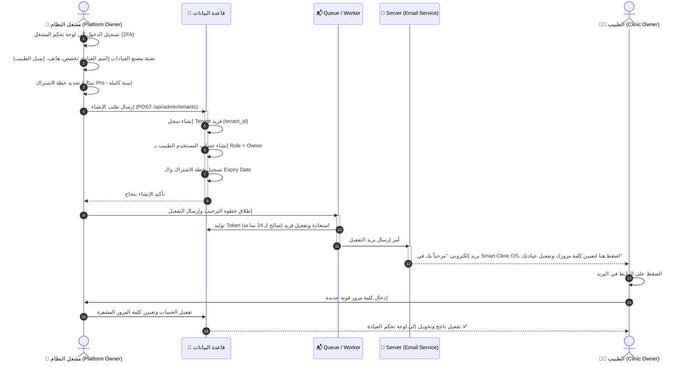
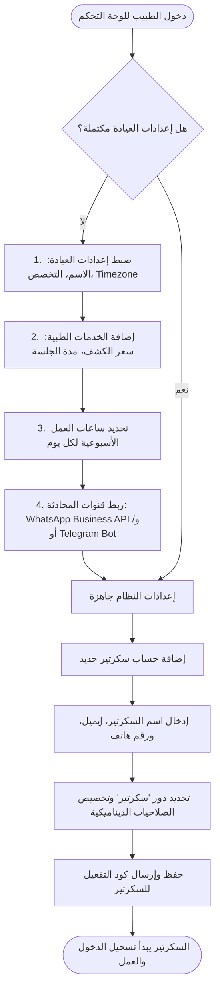
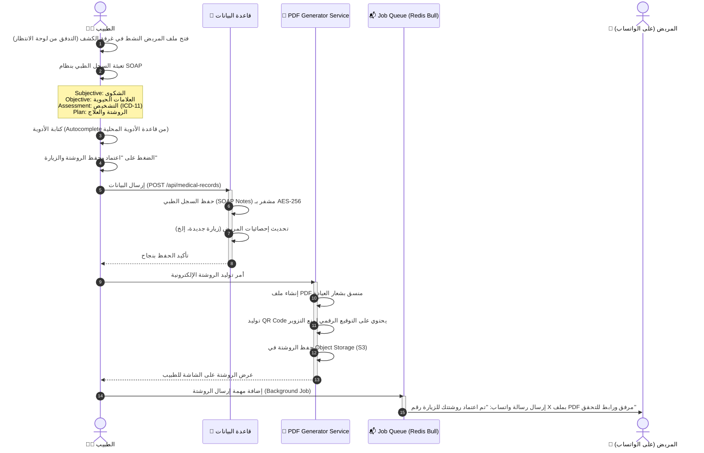
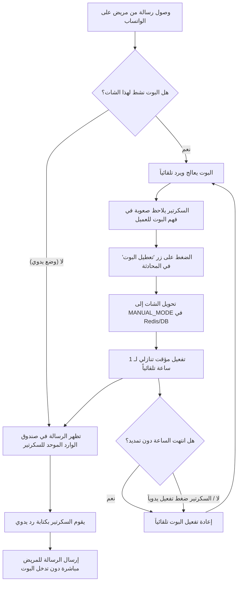
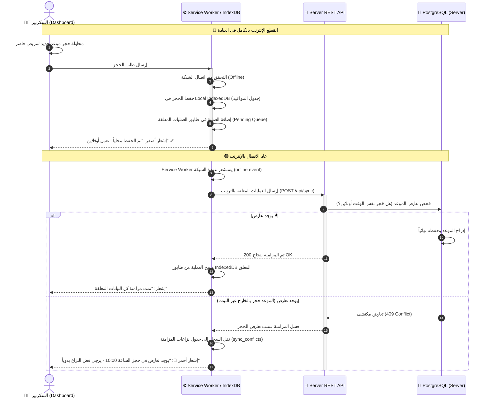
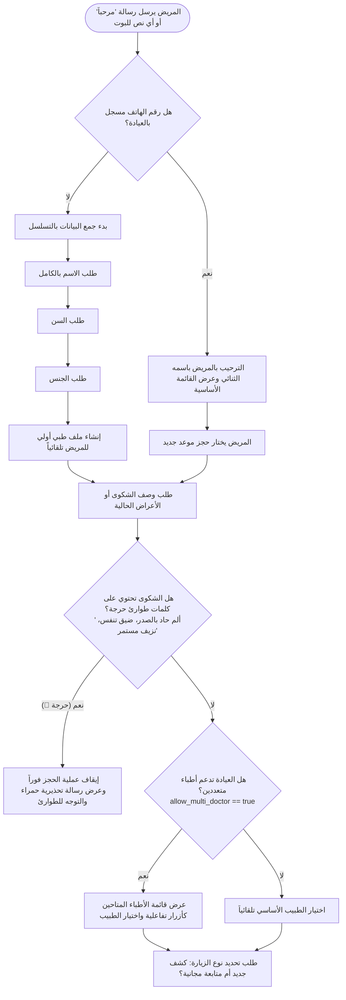
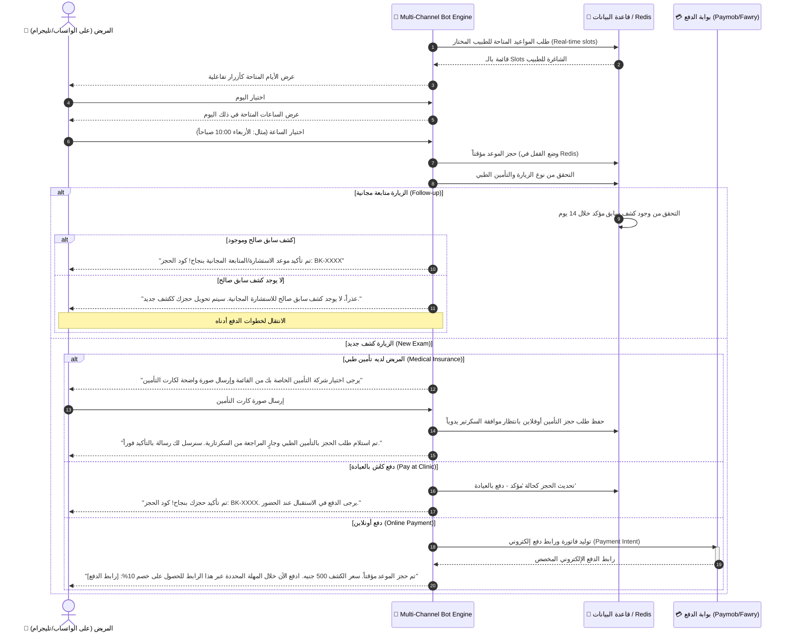
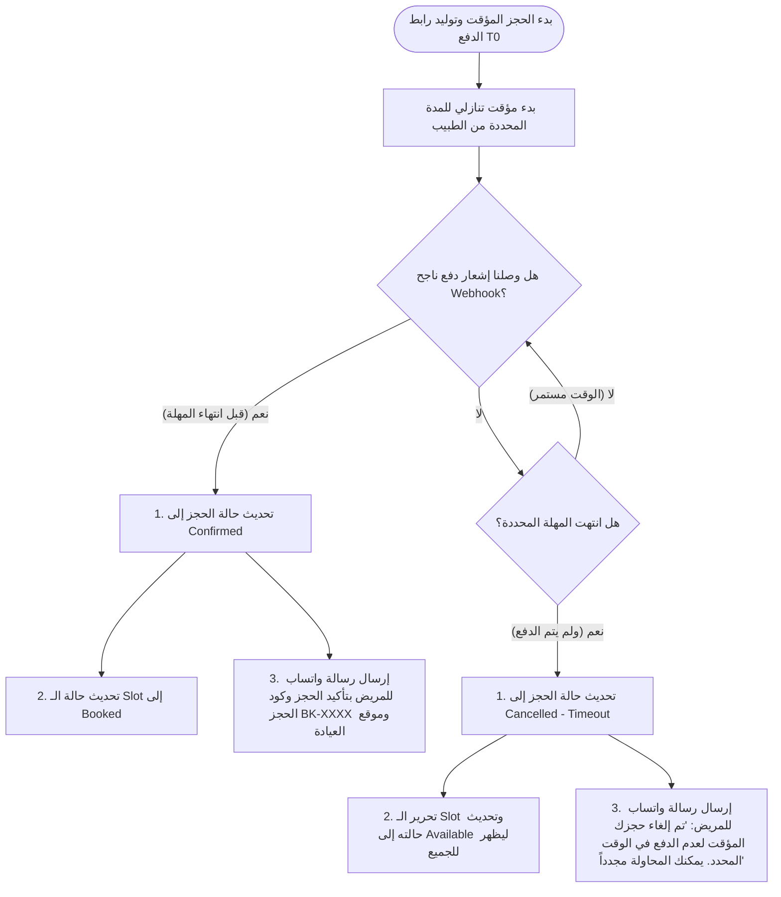

# 🔄 مستند مخططات سير العمل ورحلات المستخدمين (User Flow Diagrams)
**الإصدار:** 1.0  
**التاريخ:** 2026-07-01  
**المستند:** 3 من 9

---

## 1. نظرة عامة (Overview)

يوثق هذا المستند رحلات المستخدمين المختلفة داخل النظام (مريض، سكرتير، طبيب، ومشغل النظام/صاحب السيستم). نستخدم مخططات **Mermaid** لتوضيح تسلسل الخطوات، القرارات، والتفاعلات بين الأنظمة المختلفة والواجهات.

---

## 2. رحلات مشغل/صاحب النظام (Platform Operator / System Owner Flows)

### 2.1 رحلة إضافة عيادة جديدة وتفعيل الاشتراك (Clinic Onboarding & Subscription Activation)
يوضح هذا المسار كيف يقوم صاحب النظام (Platform Admin) بإنشاء عيادة جديدة وتوليد حساب الطبيب الأول لها.

---

## 3. رحلات الطبيب مالك العيادة (Doctor / Clinic Owner Flows)

### 3.1 رحلة إعداد العيادة وإضافة سكرتير (Clinic Setup & Staff Onboarding)
بعد دخول الطبيب للنظام لأول مرة، يجب عليه تهيئة النظام لتشغيل البوت وإضافة مساعديه.

### 3.2 رحلة فحص المريض وكتابة الروشتة الذكية (Clinical Exam & E-Prescription Flow)
تبدأ عندما يدخل المريض لغرفة الكشف وحتى إرسال الروشتة إلى هاتفه تلقائياً.

---

## 4. رحلات السكرتاريا (Secretary / Desk Operations Flows)

### 4.1 رحلة التدخل اليدوي وإيقاف البوت مؤقتاً (Manual Takeover Flow)
حماية للمريض من الردود المزدوجة عندما يحتاج السكرتير للرد بنفسه.

### 4.2 رحلة العمل دون اتصال والمزامنة (Offline Work & Sync Resolution)

---

## 5. رحلات المريض عبر البوت (Multi-Channel Patient Journey Flows: WhatsApp + Telegram)

### 5.1 رحلة الترحيب والفرز الطبي التلقائي (Onboarding & Triage Flow)

### 5.2 رحلة الحجز والدفع الإلكتروني المؤقت (Booking & Payment Journey)

### 5.3 رحلة انتهاء المهلة وإلغاء الحجز المتروك (Payment Timeout Flow)

---

## 6. القرارات المعتمدة لفض النزاعات والمهل (Approved Design Decisions)

> [!NOTE]
> بناءً على مراجعة متطلبات العمل والتشغيل، تم اعتماد القواعد التالية:

1. **فض تعارضات العمل أوفلاين**: عند حدوث تعارض (حجز نفس الساعة أونلاين وأوفلاين في نفس الوقت)، **لا يتم الإلغاء التلقائي**. بدلاً من ذلك، يعرض النظام الحجزين معاً في لوحة التحكم للسكرتير كـ "نزاع معلق"، ويقوم السكرتير بالتدخل اليدوي وحل التعارض وتعديل أحد المواعيد بالتنسيق مع المرضى.
2. **مدة مهلة الدفع**: مدة صلاحية رابط الدفع وقفل الـ Slot هي **قيمة ديناميكية يحددها الطبيب** في إعدادات عيادته (مثال: 10 دقائق، 15 دقيقة، 30 دقيقة) ويتم تخزينها في عمود `payment_timeout_minutes` بجدول `tenants`.

