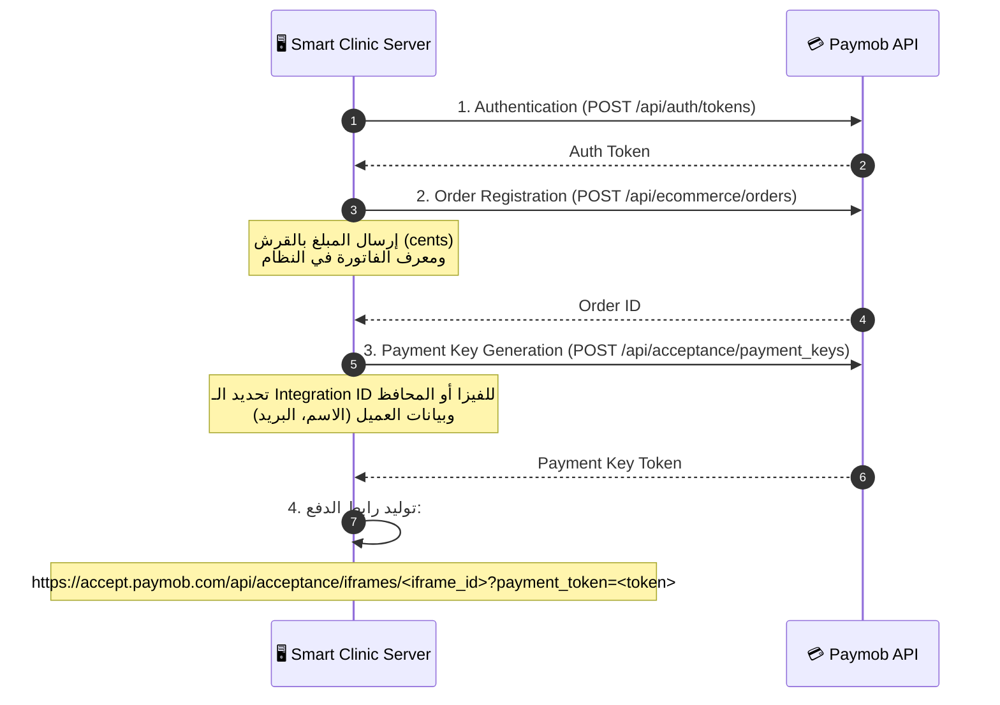

# 🔗 مستند التكاملات والخدمات الخارجية (External Integrations Specification)
**الإصدار:** 1.0  
**التاريخ:** 2026-07-01  
**المستند:** 6 من 9

---

## 1. تكامل واتساب (Meta WhatsApp Business Cloud API)

النظام يتكامل مباشرة مع **Meta Cloud API** الرسمية دون الحاجة لوسطاء (لتقليل التكلفة وزيادة سرعة التوصيل).

### 1.1 متطلبات الربط والإعداد لكل عيادة (Tenant Config)
يتم تخزين المتغيرات التالية في إعدادات العيادة (`tenants` table):
- `whatsapp_phone_number_id`: المعرف الخاص برقم الهاتف.
- `whatsapp_business_account_id`: معرف الحساب التجاري.
- `whatsapp_access_token`: الـ Permanent System User Token (مشفر بـ AES-256).

### 1.2 تدفق إرسال الرسائل الصادرة (Outgoing Messages API)
لإرسال رسالة، يقوم النظام بطلب API الخاص بـ Meta:
- **الرابط:** `POST https://graph.facebook.com/v18.0/:phone_number_id/messages`
- **الترويسات (Headers):**
  ```http
  Authorization: Bearer <whatsapp_access_token>
  Content-Type: application/json
  ```

#### أ. إرسال قالب معتمد (Meta Approved Template) — للحملات والتأكيدات:
```json
{
  "messaging_product": "whatsapp",
  "to": "201012345678",
  "type": "template",
  "template": {
    "name": "booking_confirmation",
    "language": {
      "code": "ar"
    },
    "components": [
      {
        "type": "body",
        "parameters": [
          { "type": "text", "text": "محمد أحمد" },
          { "type": "text", "text": "الأربعاء 10:00 صباحاً" },
          { "type": "text", "text": "BK-99X2" }
        ]
      }
    ]
  }
}
```

#### ب. إرسال رسائل تفاعلية بأزرار (Interactive Buttons) — للحجز:
*(ملاحظة: لا يمكن إرسالها إلا في نافذة الـ 24 ساعة من آخر رسالة للمريض).*
```json
{
  "messaging_product": "whatsapp",
  "recipient_type": "individual",
  "to": "201012345678",
  "type": "interactive",
  "interactive": {
    "type": "button",
    "body": {
      "text": "كيف يمكننا مساعدتك اليوم يا أستاذ محمد؟ يرجى اختيار أحد الخيارات التالية:"
    },
    "action": {
      "buttons": [
        {
          "type": "reply",
          "reply": {
            "id": "btn_book_new",
            "title": "📅 حجز موعد جديد"
          }
        },
        {
          "type": "reply",
          "reply": {
            "id": "btn_manage_booking",
            "title": "✏️ تعديل/إلغاء حجز"
          }
        },
        {
          "type": "reply",
          "reply": {
            "id": "btn_chat_human",
            "title": "👩‍💼 تحدث مع السكرتارية"
          }
        }
      ]
    }
  }
}
```

---

## 1B. تكامل تليجرام (Telegram Bot API)

النظام يتكامل مع **Telegram Bot API** كقناة إضافية لاستقبال وإرسال الرسائل للمرضى. يتم إنشاء بوت عبر [@BotFather](https://t.me/BotFather) ولكل عيادة بوت خاص بها.

### 1B.1 متطلبات الربط والإعداد لكل عيادة (Tenant Config)
يتم تخزين المتغيرات التالية في إعدادات العيادة (`tenants` table):
- `telegram_bot_token`: الـ Token الخاص بالبوت (مشفر بـ AES-256).
- `telegram_bot_username`: اسم البوت (مثال: `@DrAhmedClinicBot`).

### 1B.2 إعداد الـ Webhook
عند تفعيل التليجرام لعيادة جديدة، يقوم النظام تلقائياً بتسجيل الـ Webhook:
```
POST https://api.telegram.org/bot<TOKEN>/setWebhook
{
  "url": "https://api.SCS-admin.com/webhooks/telegram",
  "secret_token": "<HMAC_SECRET>",
  "allowed_updates": ["message", "callback_query"]
}
```

### 1B.3 تدفق إرسال الرسائل الصادرة (Outgoing Messages API)

#### أ. إرسال رسالة نصية:
```json
POST https://api.telegram.org/bot<TOKEN>/sendMessage
{
  "chat_id": 7654321,
  "text": "مرحبا أستاذ محمد! 👋\nعيادة دكتور أحمد ترحب بك.\nكيف يمكننا مساعدتك؟",
  "parse_mode": "HTML"
}
```

#### ب. إرسال رسالة تفاعلية بأزرار (Inline Keyboard) — للحجز:
```json
POST https://api.telegram.org/bot<TOKEN>/sendMessage
{
  "chat_id": 7654321,
  "text": "كيف يمكننا مساعدتك اليوم يا أستاذ محمد؟ يرجى اختيار أحد الخيارات التالية:",
  "reply_markup": {
    "inline_keyboard": [
      [{ "text": "📅 حجز موعد جديد", "callback_data": "btn_book_new" }],
      [{ "text": "✏️ تعديل/إلغاء حجز", "callback_data": "btn_manage_booking" }],
      [{ "text": "👩‍💼 تحدث مع السكرتارية", "callback_data": "btn_chat_human" }]
    ]
  }
}
```

#### ج. إرسال ملف PDF (الروشتة الإلكترونية):
```json
POST https://api.telegram.org/bot<TOKEN>/sendDocument
{
  "chat_id": 7654321,
  "document": "https://cdn.SCS-admin.com/prescriptions/rx-uuid.pdf",
  "caption": "📋 روشتة الكشف الطبي من عيادة دكتور أحمد\nكود التحقق: RX-ABC123"
}
```

### 1B.4 فروقات مهمة بين WhatsApp و Telegram

| البند | WhatsApp | Telegram |
|-------|----------|----------|
| **التكلفة** | مدفوع لكل محادثة (Conversation-based pricing) | مجاني بالكامل |
| **نافذة الـ 24 ساعة** | نعم — بعدها يجب استخدام Templates | لا توجد قيود |
| **الأزرار** | Interactive Buttons (3 أزرار كحد أقصى) | Inline Keyboard (غير محدود) |
| **اعتماد القوالب** | يجب اعتماد Template Messages من Meta | لا يحتاج اعتماد |
| **إرسال ملفات** | يدعم (عبر Media Upload) | يدعم (عبر URL أو Upload) |
| **الانتشار في مصر** | عالي جداً | متوسط ومتزايد |
| **تحقق الهوية** | عبر رقم الهاتف | عبر Telegram User ID |

> [!TIP]
> **نصيحة تشغيلية:** يمكن للعيادة تفعيل القناتين معاً (WhatsApp + Telegram) أو واحدة فقط حسب الاشتراك وتفضيل المرضى. لكل مريض يتم تسجيل القناة التي تواصل من خلالها (`conversations.channel`).

---

## 2. تكامل بوابة الدفع (Paymob Integration)


Paymob هي بوابة الدفع الأساسية لتوفير الدفع بالكروت البنكية والمحافظ الإلكترونية (فودافون كاش، اتصالات كاش، إلخ).

### 2.1 خطوات إنشاء رابط الدفع (Payment Flow Steps)



### 2.2 التحقق من المعاملة عبر الـ Webhook (Transaction Verification)
عند إتمام الدفع، يرسل Paymob طلب POST (Webhook) للسيرفر.
- **تأمين الـ Webhook:**
  يقوم السيرفر بحساب توقيع HMAC SHA256 للبيانات المستلمة ومقارنتها بالتوثيق المرسل من Paymob لمنع التزوير.
- **المتغيرات المطلوبة في الـ HMAC:**
  `amount_cents` + `created_at` + `currency` + `error_occured` + `has_parent_transaction` + `id` + `integration_id` + `is_3d_secure` + `is_auth` + `is_capture` + `is_voided` + `is_refunded` + `owner` + `pending` + `source_data.pan` + `source_data.sub_type` + `source_data.type` + `success`
- **الحركات التشغيلية بعد نجاح الدفع:**
  1. تحديث حالة الفاتورة (`invoices.status = 'paid'`).
  2. تحديث حالة الحجز (`appointments.status = 'confirmed'`).
  3. تحويل حالة الـ Slot (`time_slots.status = 'booked'`).
  4. إرسال تأكيد فوري للمريض على الواتساب.

---

## 3. تكامل بوابة فوري (Fawry Pay Integration)

فوري هو خيار بديل مفضل جداً للمرضى في مصر للدفع نقداً عبر ماكينات فوري المنتشرة.

### 3.1 تدفق الحجز برقم فوري المرجعي (Reference Code Flow)
1. المريض يختار خيار "فوري" عبر البوت.
2. السيرفر يطلب من فوري كود دفع مرجعي:
   - **الرابط:** `POST https://www.fawryconnect.com/ECommerceAPI/api/payments/charge`
   - **المدخلات:** معرف التاجر، الرقم المرجعي للفاتورة، البيانات الحيوية للمريض، والمبلغ.
3. فوري يعيد **كود مرجعي (Reference Number)** فريد ومكون من 10 أرقام.
4. يرسل البوت الكود للمريض: *"الرجاء التوجه لأي منفذ فوري والدفع باستخدام كود الخدمة (788) والرقم المرجعي الخاص بك: `1234567890` خلال المهلة المحددة لحجزك لضمان عدم إلغائه"*.
5. عند سداد المريض في أي كشك، يرسل سيرفر فوري إشعار نجاح (Webhook) للسيرفر الخاص بنا لتأكيد الحجز فوراً وتحويل حالته إلى مؤكد (`confirmed`).

---

## 4. توليد الروشتة والتوقيع الرقمي (E-Prescription & QR Code Verification)

لمنع التزوير وضمان حماية وتوثيق الروشتات الإلكترونية الصادرة عن الأطباء في المنصة.

### 4.1 خوارزمية التوقيع الرقمي (Digital Signature Cryptography)
1. عند كتابة الطبيب للروشتة وحفظها، يقوم النظام بتجميع البيانات الهامة في نص موحد (Payload):
   ```
   tenant_id + doctor_id + patient_name + date + prescription_items_hash
   ```
2. يقوم النظام بتوقيع هذا النص باستخدام **الرمز الخاص بالطبيب (Doctor's Private Key)** المحفوظ في KMS مشفراً، باستخدام خوارزمية **RSASSA-PKCS1-v1_5** (مع SHA-256).
3. يتم حفظ هذا التوقيع الرقمي (Signature) في عمود `digital_signature` بجدول `prescriptions`.

### 4.2 كود الـ QR والتحقق (QR Verification Protocol)
1. يتم توليد QR Code يطبع في أسفل ملف الروشتة الـ PDF.
2. **البيانات المضمنة بالـ QR Code:**
   الـ QR لا يحتوي على رابط إنترنت عام يظهر الروشتة للجميع (لحماية خصوصية المريض)، بل يحتوي على رابط مشفر وموثق:
   ```
   https://verify.SCS-admin.com/rx/:prescription_uuid?sig=<digital_signature>
   ```
3. عند قيام الصيدلي بمسح الـ QR:
   - يوجهه المتصفح لصفحة التحقق التابعة للمنصة.
   - السيرفر يقرأ الـ `prescription_uuid` ويجلب مفتاح الطبيب العام (Public Key).
   - يتحقق السيرفر من صحة التوقيع الرقمي.
   - إذا كان التوقيع سليماً والبيانات لم يتم تعديلها أو التلاعب بها، يعرض صفحة خضراء هادئة: **"تم التحقق: الروشتة سليمة ومصدرها د. محمد النور وموجهة للمريض أحمد محمد بتاريخ 2026-07-01"**، ويعرض الأدوية المعتمدة فقط.

---

## 5. محرك الفرز الطبي وبوت الأسئلة التفاعلي (WHO ICD-11 & Triage Integration)

يتكامل النظام مع المعايير الطبية الدولية لتصنيف الأمراض والشكاوى.

### 5.1 البحث التلقائي عن أكواد الأمراض (ICD-11 Integration)
لتسهيل عمل الأطباء، يتكامل النظام مع واجهة برمجة تطبيقات **منظمة الصحة العالمية (WHO ICD-11 API)**:
- **آلية العمل:**
  أثناء طباعة الطبيب للتشخيص في حقل الـ Assessment، يتم إرسال طلبات بحث فرعية (Debounced Search HTTP Request) إلى الـ API الداخلي الذي يطابق النصوص مع أكواد ICD-11:
  - **الرابط:** `GET https://id.who.int/icd/release/11/2023-01/mms/search?q=:query`
  - يعاد للطبيب قائمة خيارات منسقة مثل: `L70.0 - Acne vulgaris` ليختار منها بضغطة زر ويتم ربطها بملف المريض للتقارير والأبحاث الطبية لاحقاً.

---

## 6. تكامل خدمات البريد الإلكتروني (Email Service Integration: SendGrid / AWS SES)

يتكامل النظام مع مزودي خدمات البريد الإلكتروني السحابية (بشكل أساسي **SendGrid API** أو **AWS SES API**) لإرسال التنبيهات المجدولة، الفواتير، والروشتات الطبية.

### 6.1 متطلبات الربط والإعداد للنظام والعيادة (Tenant & System Config)
- **إعدادات النظام العامة (System Operations):**
  - `ops_email_sender`: بريد الإرسال الرسمي للأوبريشن (`no-reply@SCS-ops.com`).
  - `sendgrid_api_key` / `aws_ses_keys`: مفاتيح الربط مع المزود السحابي.
- **إعدادات العيادة (Tenant Config):**
  - `clinic_email_sender`: بريد العيادة للإرسال (مثال: `no-reply@drahmed.com`).
  - `email_signature`: التوقيع التلقائي لبريد العيادة.

### 6.2 واجهة إرسال البريد الإلكتروني (Outgoing Email Payload)
تُرسل الطلبات عبر الـ Background Worker (مثل `send-email-notification`):

#### أ. إرسال تأكيد حجز للمريض (Patient Booking Confirmation):
- **الطلب المرسل للمزود (SendGrid JSON example):**
```json
POST https://api.sendgrid.com/v3/mail/send
Headers: { "Authorization": "Bearer <SENDGRID_API_KEY>" }
{
  "personalizations": [
    {
      "to": [{ "email": "patient@example.com" }],
      "dynamic_template_data": {
        "patient_name": "محمد أحمد",
        "clinic_name": "عيادة النور لطب الأسنان",
        "doctor_name": "د. محمد النور",
        "appointment_time": "الأربعاء 08 يوليو 2026 الساعة 10:00 صباحاً",
        "booking_code": "BK-99X2",
        "clinic_address": "شارع الطيران، مدينة نصر، القاهرة",
        "clinic_location_url": "https://maps.google.com/?q=30.0594885,31.3418556"
      }
    }
  ],
  "from": { "email": "no-reply@SCS-admin.com", "name": "Smart Clinic System" },
  "reply_to": { "email": "info@noorclinic.com", "name": "Noor Clinic Support" },
  "template_id": "d-template-uuid-booking-confirm"
}
```

#### ب. إرسال الروشتة الطبية PDF للمريض (E-Prescription Email with PDF attachment):
- **الطلب المرسل للمزود (SendGrid with attachment):**
```json
POST https://api.sendgrid.com/v3/mail/send
{
  "personalizations": [
    {
      "to": [{ "email": "patient@example.com" }],
      "dynamic_template_data": {
        "patient_name": "محمد أحمد",
        "doctor_name": "د. محمد النور",
        "prescription_code": "RX-2026-0001"
      }
    }
  ],
  "from": { "email": "no-reply@SCS-admin.com", "name": "Smart Clinic System" },
  "subject": "روشتتك الإلكترونية المعتمدة - عيادة د. محمد النور",
  "content": [
    {
      "type": "text/html",
      "value": "<p>مرحباً محمد أحمد، مرفق طيه الروشتة الإلكترونية الموقعة رقمياً لكشفك اليوم.</p>"
    }
  ],
  "attachments": [
    {
      "content": "base64_encoded_pdf_content_here",
      "filename": "rx-2026-0001.pdf",
      "type": "application/pdf",
      "disposition": "attachment"
    }
  ]
}
```

#### ج. إرسال إشعارات الاشتراكات للأوبريشن (Operations Subscription Alert):
- **الطلب المرسل للمزود:**
```json
POST https://api.sendgrid.com/v3/mail/send
{
  "personalizations": [
    {
      "to": [{ "email": "ops@SCS-ops.com" }],
      "dynamic_template_data": {
        "tenant_name": "عيادة د. محمد النور",
        "plan_name": "Pro Plan",
        "expires_at": "2027-07-01",
        "amount_paid": "5000 EGP",
        "invoice_link": "https://www.SCS-ops.com/billing/invoices/inv-uuid"
      }
    }
  ],
  "from": { "email": "system-alerts@SCS-ops.com", "name": "SCS System Alerts" },
  "template_id": "d-template-uuid-ops-subscription-alert"
}
```

