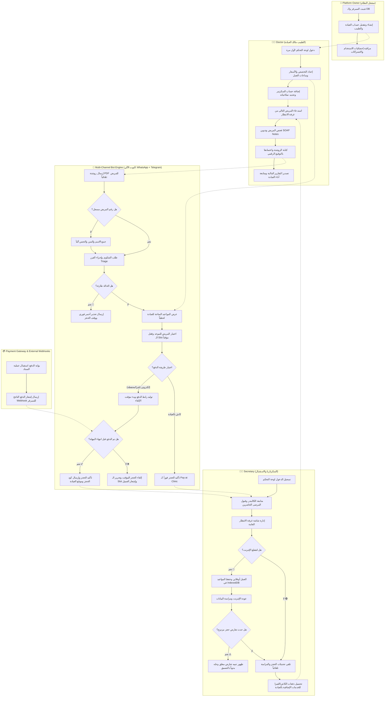

# 🗺️ مستند خطة التنفيذ ومخطط العمليات (Phased Roadmap & BPMN Process Model)
**الإصدار:** 1.0  
**التاريخ:** 2026-07-01  
**المستند:** 9 من 9

---

## 1. مخطط عمليات البيزنس العام (BPMN Process Diagram)

يوضح هذا المخطط (BPMN Model) تدفق العمليات الكامل والأدوار المختلفة (المشغل، الطبيب، السكرتير، المريض، والنظام الآلي للبوت والدفع) ودورة حياة الموعد والخدمة الطبية بالكامل:



---

## 2. خطة التنفيذ المرحلية (Phased Implementation Roadmap)

تم تقسيم المشروع إلى **4 مراحل متتالية** لضمان تسليم قيمة تشغيلية بأسرع وقت (Time-to-Market) واختبار النظام بشكل تدريجي.

```
  المرحلة 1: الأساس والأدمن            المرحلة 2: البوت والدفع           المرحلة 3: لوحة التحكم وEMR         المرحلة 4: الأوفلاين والتسويق
┌──────────────────────────┐      ┌──────────────────────────┐      ┌──────────────────────────┐      ┌──────────────────────────┐
│ - إعداد البيئة والداتا   │      │ - محرك محادثة الواتساب   │      │ - شات الاستقبال الموحد   │      │ - تشغيل الـ PWA كاملاً   │
│ - عزل الـ Multi-Tenant   │ ───> │ - قراءة الكاليندر الفعلي │ ───> │ - السجل SOAP والروشتات   │ ───> │ - المزامنة وحل النزاعات │
│ - لوحة تحكم صاحب السيستم  │      │ - ربط بوابة Paymob/Fawry │      │ - لوحة الفحص والأسنان    │      │ - محرك الرسائل الجماعية  │
│ - تسجيل دخول الموظفين    │      │ - موقتات إلغاء الحجز     │      │ - شاشة الانتظار العامة TV│      │ - تقارير الـ BI المتقدمة │
└──────────────────────────┘      └──────────────────────────┘      └──────────────────────────┘      └──────────────────────────┘
```

---

### 📅 المرحلة 1: البنية الأساسية والأمن وإدارة المنصة (Weeks 1-4)
*الهدف: بناء الهيكل الرئيسي لقاعدة البيانات وعزل المستأجرين وتشغيل لوحة تحكم صاحب السيستم لتفعيل الأطباء وإدارة باقات الاشتراك.*

* **المهام الرئيسية:**
  1. إعداد بيئة السيرفر (Docker Compose + Node.js TS + PostgreSQL 16 + Redis).
  2. إنشاء الـ Database Tables وتفعيل سياسة الـ Row-Level Security (RLS) لعزل العيادات منطقياً مع إضافة حقول الـ Feature Flags للـ Tenants.
  3. تنفيذ نظام الحماية وأكواد تشفير الحقول الطبية الحساسة (AES-256-GCM).
  4. بناء نظام تسجيل الدخول لمدير المنصة (Owner) وتفعيل الـ 2FA.
  5. بناء نظام تسجيل الدخول للأطباء والموظفين وتفعيل نظام القفل التلقائي للحساب بعد 3 محاولات خاطئة.
  6. تطوير لوحة مشغل النظام (Platform Owner Dashboard) لإنشاء العيادات، تفعيل الاشتراكات، وإعادة تعيين كلمات المرور، مع تفعيل/تعطيل خصائص الـ Multi-doctor والـ Insurance والـ Refunds للـ tenant بناءً على باقته.
* **محطة التسليم (Milestone 1):** لوحة تحكم صاحب السيستم تعمل بنجاح، ويمكنه إضافة عيادة جديدة وتعيين اشتراكها والـ feature flags الخاصة بها وتوليد حساب الطبيب بنجاح.

---

### 📅 المرحلة 2: محرك البوت متعدد القنوات والحجز الذكي والمدفوعات (Weeks 5-8)
*الهدف: تمكين المرضى من التفاعل مع البوت عبر واتساب وتليجرام، حجز المواعيد الفعلية، والدفع أونلاين.*

* **المهام الرئيسية:**
  1. ربط الـ WhatsApp Cloud Webhook والتحقق من التوقيع الأمني الخاص بـ Meta + ربط Telegram Bot API Webhook (عبر BotFather).
  2. تطوير محرك الحالات للبوت (Conversation State Machine) وحفظ الحالات بـ Redis.
  3. ربط البوت بقاعدة البيانات لقراءة المواعيد الشاغرة لحظياً (Real-time slot selection) مع دعم اختيار الطبيب الفرعي (إذا كانت ميزة `allow_multi_doctor` مفعلة).
  4. تطوير نظام الـ Triage والفرز الآلي للكلمات الحرجة لوقف الحجوزات الطارئة.
  5. ربط بوابة Paymob (فيزا ومحافظ إلكترونية) وفوري لتوليد روابط الدفع ورموز السداد، ودعم مسارات الدفع والتأمين المبدئي والمتابعة المجانية (فحص أحقية المريض للمتابعة خلال 14 يوماً).
  6. تشغيل الـ Background Workers (BullMQ) لمعالجة موقتات حجز المواعيد وإلغائها تلقائياً في حال عدم الدفع، مع معالجة عمليات الاسترداد (Refunds) للرصيد بالعيادة أو تلقائياً للبوابة.
* **محطة التسليم (Milestone 2):** مريض جديد يستطيع التحدث مع البوت بالكامل، كتابة شكواه، اختيار الطبيب، تحديد نوع الزيارة (كشف/متابعة)، اختيار موعد متاح، استلام رابط الدفع، وإتمام الحجز والدفع أو الرفع بالتأمين الطبي.

---

### 📅 المرحلة 3: لوحة العيادة، EMR، والروشتة الإلكترونية وشاشة الـ TV (Weeks 9-12)
*الهدف: تمكين الطبيب والسكرتير من العمل داخل العيادة وإصدار الروشتات وتنظيم الطابور.*

* **المهام الرئيسية:**
  1. تطوير صندوق الوارد الموحد (Omnichannel Inbox) ومفتاح تعطيل البوت يدوياً (Manual Mode).
  2. إضافة وإدارة الأطباء الفرعيين وجداول عملهم وساعات عملهم الاستثنائية من قبل الطبيب الأدمن (طالما الـ `allow_multi_doctor` مفعلة).
  3. بناء كابينة الطبيب لتسجيل SOAP Notes وربط البحث بأكواد ICD-11 للأمراض.
  4. تطوير إضافات التخصصات (أداة رسم مناطق الحقن للجلدية، وجدول الأسنان التفاعلي للأسنان).
  5. تطبيق نظام التوقيع الرقمي للروشتات بـ Private/Public key وتوليد الروشتة PDF بـ QR كود آمن ومحمي.
  6. ربط السيرفر بالـ WebSockets (Socket.io) وتطوير واجهة شاشة التلفزيون العامة (Waiting Room TV) مع دعم تصنيف الطوابير حسب الطبيب الفرعي.
  7. معالجة طلبات التأمين الطبي المرفوعة من البوت (موافقة/رفض السكرتير بالاستقبال للبطاقة المرفوعة) لتأكيد الحجز.
  8. تمكين الطبيب والسكرتير من إصدار فواتير إضافية للخدمات الطبية غير الكشف وإرسال روابط دفعها للمريض تلقائياً.
* **محطة التسليم (Milestone 3):** الطبيب يفحص المريض في العيادة، يعتمد الروشتة الرقمية التي تصل للمريض فوراً على الواتساب، ويقوم بندائه لتصدر شاشة التلفزيون صوتاً وتحديثاً تلقائياً للمريض التالي.


---

### 📅 المرحلة 4: العمل بدون اتصال، الحملات التسويقية، والتحليلات (Weeks 13-16)
*الهدف: ضمان استمرارية التشغيل عند انقطاع الإنترنت، إرسال العروض بأمان، وعرض تقارير ذكاء الأعمال.*

* **المهام الرئيسية:**
  1. تحويل لوحة التحكم لتطبيق PWA وتفعيل الـ Service Workers.
  2. بناء نظام التخزين المحلي في IndexedDB (مواعيد اليوم والعملاء الأساسيين).
  3. تطوير نظام مزامنة العمليات المعلقة (POST /api/sync) وفك النزاعات المعلقة يدوياً للسكرتير.
  4. تطوير محرك الحملات التسويقية (Bulk Campaigns Worker) مع الفواصل العشوائية (2-5 ثوانٍ) وقفل ساعات الليل الهادئة.
  5. بناء لوحات تقارير الأداء المالي (إيرادات، خصومات، كاش vs فيزا) وأداء البوت (No-shows, Bot conversion).
* **محطة التسليم (Milestone 4):** انقطاع الإنترنت في العيادة دون توقف السكرتيرة عن العمل، ومزامنة كل شيء يدوياً وحل التعارضات عند عودة الاتصال، وإطلاق حملة تسويقية آمنة بنجاح.

---

## 3. خطة إطلاق النسخة الأولى والتقييم (Launch & Feedback Loop)

1. **النسخة التجريبية الأولى (Internal Alpha):** في نهاية الأسبوع الرابع (إطلاق لوحة مشغل النظام والتأكد من أمان البيانات والعزل).
2. **النسخة التجريبية المغلقة (Private Beta):** في نهاية الأسبوع الثامن (اختبار البوت والمدفوعات على عيادتين تجريبيتين لرصد ردود فعل المرضى).
3. **النسخة الكاملة للعيادات (Soft Launch):** في نهاية الأسبوع الثاني عشر (تشغيل EMR وشاشة الانتظار).
4. **النسخة المستقرة المعتمدة (General Availability):** في نهاية الأسبوع السادس عشر (بعد تشغيل المزامنة أوفلاين وحملات التسويق).

