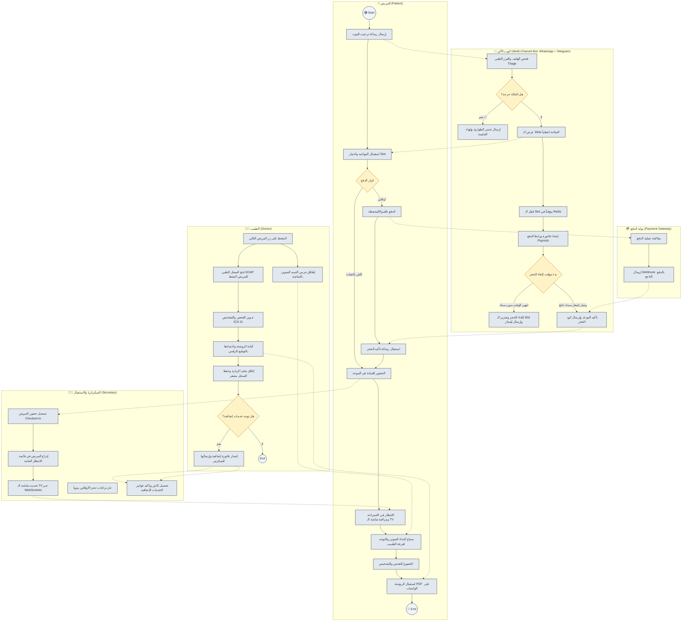
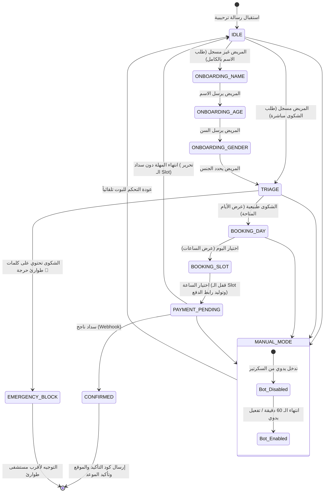
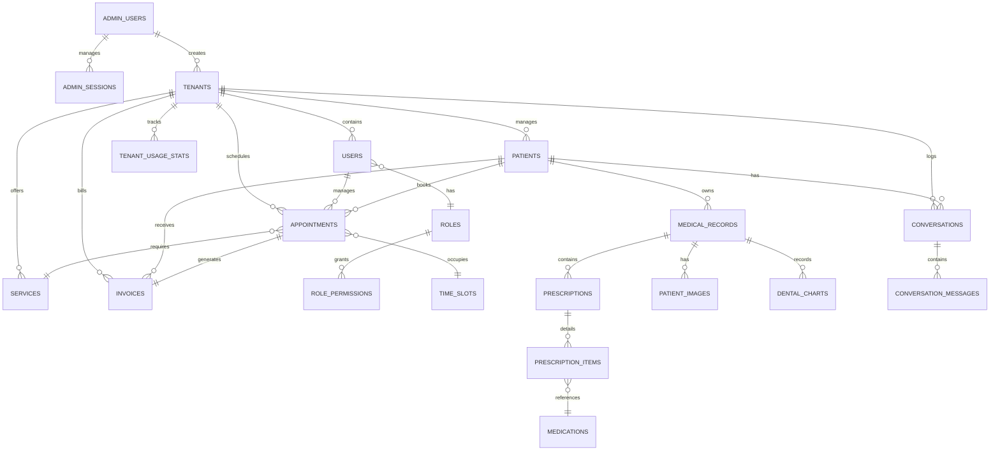
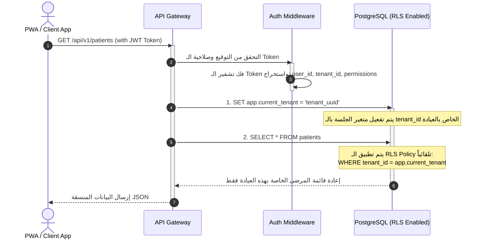
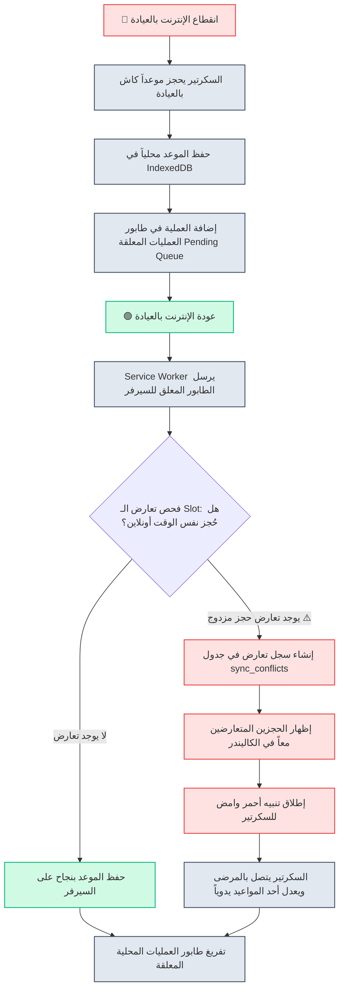

# 📊 دليل المخططات والرسومات الهندسية للمشروع (Complete System Diagrams Guide)
**الإصدار:** 1.0  
**التاريخ:** 2026-07-01  
**المستند:** 10 من 10

---

## 1. نظرة عامة (Overview)

يجمع هذا المستند **كل المخططات والرسومات الهندسية الهامة** للمشروع بنظام **Mermaid** التفاعلي. تغطي هذه المخططات الجوانب التشغيلية، والبرمجية، وبنية البيانات ليكون مرجعاً مرئياً سريعاً للمطورين ومحللي النظام.

---

## 2. مخطط العمليات الشامل (BPMN 2.0 Business Process Diagram)

يوضح هذا المخطط حارات الأدوار المختلفة والرسائل المتبادلة بين المريض، البوت، السكرتير، الطبيب وبوابة الدفع:

---

## 3. مخطط آلة الحالات للبوت متعدد القنوات (Multi-Channel Bot State Machine Diagram: WhatsApp + Telegram)

يوضح هذا المخطط الانتقال بين الحالات المختلفة (States) للمحادثة بناءً على مدخلات المريض:

---

## 4. مخطط الكيانات والعلاقات التفصيلي لقاعدة البيانات (Detailed ERD)

مخطط يوضح الجداول الأساسية والعلاقات ومفاتيح الربط والـ Multi-tenancy:

---

## 5. مخطط معالجة طلبات الـ Multi-Tenant وعزل البيانات (RLS Flow)

يوضح كيف يتدفق الـ Request ويتأكد السيرفر وقاعدة البيانات من عزل بيانات العيادة (`tenant_id`):

---

## 6. مخطط المزامنة أوفلاين وفض تعارض الحجز المزدوج (Offline Sync & Conflict Resolution)

يوضح كيف تعمل قائمة الانتظار للمزامنة عند عودة الإنترنت وتنبيهات السكرتير بالتعارض:

