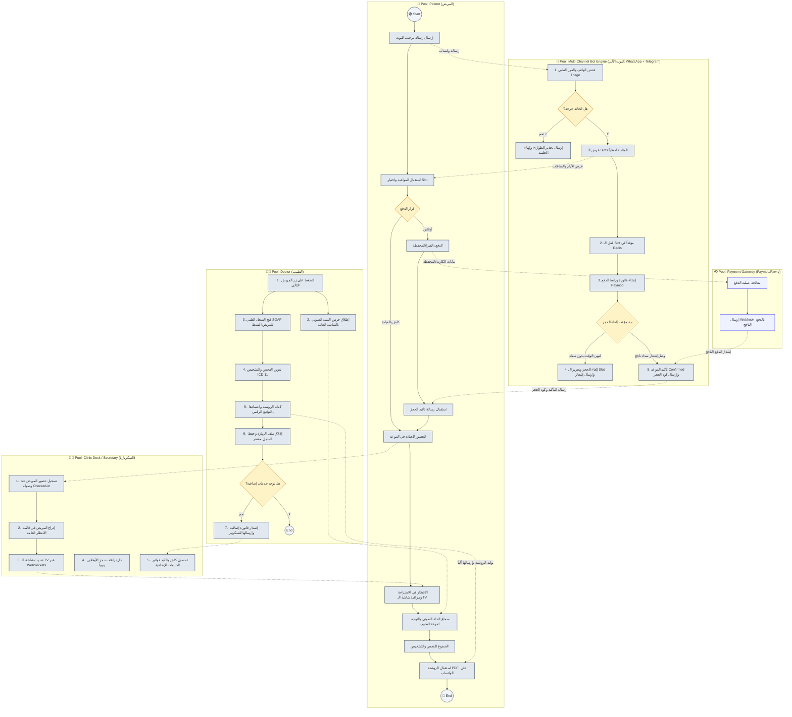

# 📊 مخطط عمليات البيزنس (BPMN 2.0 Business Process Diagram)
**الإصدار:** 1.0  
**التاريخ:** 2026-07-01  

---

## 1. مقدمة (Introduction)

يوثق هذا المستند **مخطط نمذجة عمليات الأعمال (BPMN 2.0)** بالتفصيل لمنصة عيادتي الذكية (Smart Clinic OS). يوضح المخطط كيفية تداخل الأدوار المختلفة (المريض، البوت، السكرتير، الطبيب، وبوابة الدفع) والرسائل المتبادلة بين الحارات (Lanes) المختلفة عبر دورة حياة المريض الكاملة من الحجز وحتى الخروج والروشتة.

---

## 2. مخطط BPMN التفاعلي (BPMN Mermaid Diagram)

---

## 3. شرح عناصر العمليات وتدفق الرسائل (BPMN Elements & Message Flows)

### 3.1 الأحداث (Events)
- **حدث البداية (Start Event):** يتم إطلاقه عندما يرسل المريض رسالة نصية لأول مرة إلى رقم العيادة عبر الواتساب.
- **حدث النهاية (End Event):** ينتهي المسار عند استلام المريض لروشتة الـ PDF الموقعة رقمياً وخروجه من العيادة.

### 3.2 المهام الموزعة (Tasks Classification)
- **مهام مستخدم (User Tasks):** 
  - اختيار الموعد بالواتساب من المريض.
  - تسجيل حضور المريض وحل النزاعات من السكرتير.
  - فحص المريض وتدوين التشخيص من الطبيب.
- **مهام آليّة (Service Tasks):**
  - فحص الهاتف، الفرز الطبي (Triage)، توليد رابط الدفع، وإرسال الروشتة بالكامل عبر البوت (`Bot Engine`).
  - معالجة عمليات الدفع عبر البوابة الإلكترونية (`Paymob`).

### 3.3 البوابات القرارية (Gateways)
- **بوابة الفرز الطبي (Triage Exclusive Gateway):** تفصل بين تحويل المريض للحجز العادي أو توجيهه الفوري للطوارئ لإنقاذ حياته.
- **بوابة مهلة الدفع (Timeout Gateway):** تعمل كـ Event-based Gateway لمراقبة أي الحالتين ستحدث أولاً: استلام إشعار الدفع الناجح (Confirm) أم انتهاء العداد التنازلي للمهلة دون سداد (Cancel).
- **بوابة الخدمات الإضافية (Extra Services Gateway):** تقرر ما إذا كان الطبيب يحتاج لطلب سداد خدمات إجراءات تجميلية أو جراحية إضافية عبر السكرتير والمريض.

